# Assignment 5 — Bash Script Automation Drill (OPS Checklist)

Part of the DevOps Micro Internship (DMI) Cohort 3 with Agentic AI

---

## Purpose

In this assignment, you will practice Bash scripting by building a series of small automation scripts covering environment setup, variables, arrays, loops, file conditionals, if-else logic, and functions. These scripts form the foundation of real-world Linux automation used in DevOps, cloud, and production support environments.

---

# Task 1 — Bash Environment & Workspace Setup

## Goal

Verify that Bash is available on your system and create a clean workspace for this assignment.

### Evidence

#### Screenshot 1 — Output of `echo $SHELL` and `bash --version`

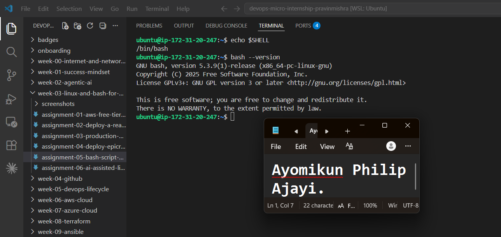

---

#### Screenshot 2 — Output of `pwd` and `ls -lah` showing the scripts directory

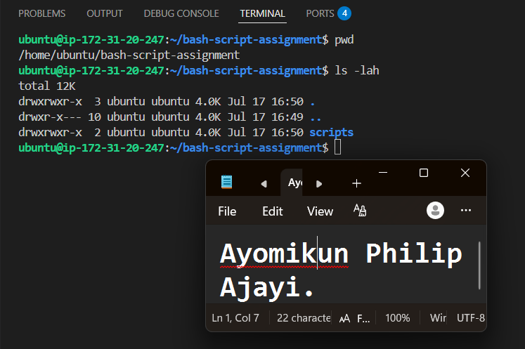

---

### Notes

Answer the following in your own words:

**1. What is Bash?**

Bash is a command-line shell and scripting language found on Unix-based operating systems.

---

**2. What is the difference between shell and Bash?**

A **shell** is any program that lets you type commands to control your computer, while **Bash** is one specific and very popular type of shell.

---

**3. Why is it important to confirm the Bash version before writing scripts?**

It's important to confirm the Bash version because different versions support different features, and a script written for a newer version may not work on an older one.

---

# Task 2 — Your First Bash Script

## Goal

Create your first Bash script, make it executable, and run it from the terminal.

### Evidence

#### Screenshot 1 — Content of `first-script.sh`

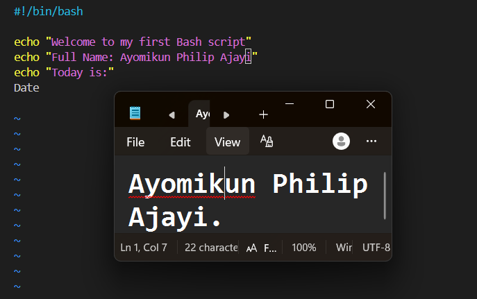

---

#### Screenshot 2 — Output of `./first-script.sh`

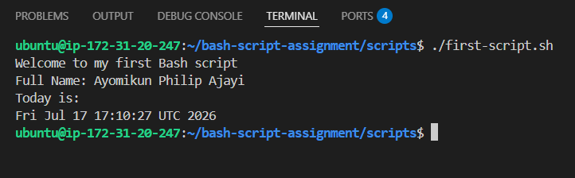

---

#### Screenshot 3 — Output of `ls -l first-script.sh` showing executable permission

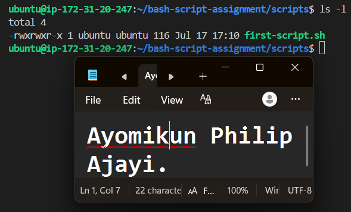

---

### Notes

Answer the following in your own words:

**1. What is the purpose of `#!/bin/bash`?**

It tells the operating system to run the script using the Bash shell, so it knows how to interpret and execute the commands in the script.

---

**2. Why do we use `chmod +x` before running a script?**

It gives Bash the permission to execute the file.

---

**3. What is the difference between running a script using `./script.sh` and `bash script.sh`?**

./script.sh runs the script as an executable and uses the interpreter specified in the first line (the shebang, e.g. #!/bin/bash).
bash script.sh explicitly tells Bash to run the script, ignoring the shebang and using Bash regardless of what the first line says.

---

# Task 3 — Variables: User Information Script

## Goal

Use variables to store and display user-related information.

### Evidence

#### Screenshot 1 — Content of `user-info.sh`

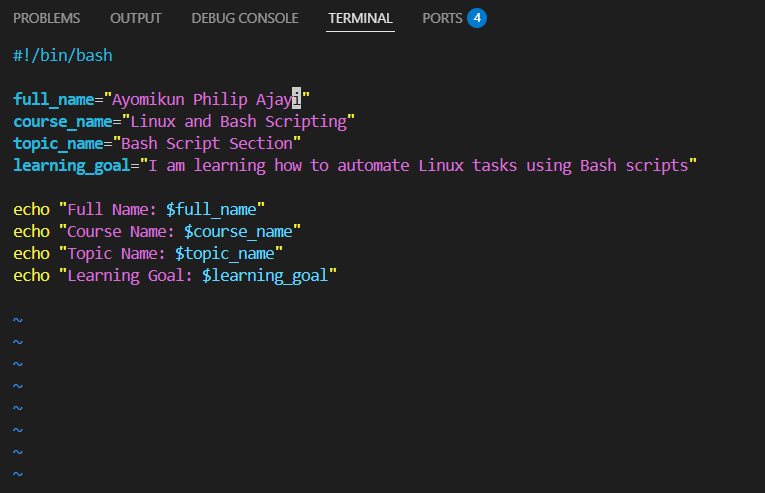

---

#### Screenshot 2 — Output of `./user-info.sh`

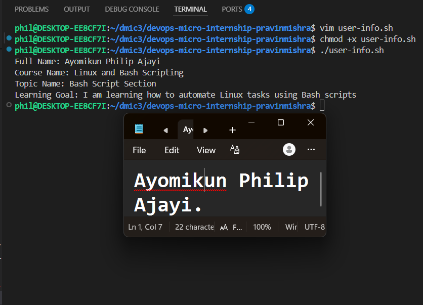

---

### Notes

Answer the following in your own words:

**1. What is a variable in Bash?**

A variable is like a container that contains value that will be later used in the script.

---

**2. Why should we avoid spaces around the `=` sign when creating variables?**

Because in Bash, spaces around = make it invalid syntax. Bash treats the parts as separate commands or arguments instead of assigning a value to the variable.

---

**3. How do you access the value stored inside a Bash variable?**

By adding the $ symbol before the variable name.

---

# Task 4 — Arrays & Loops: Tools Checklist Script

## Goal

Use arrays and loops to print a checklist of tools used in Bash scripting.

### Evidence

#### Screenshot 1 — Content of `tools-checklist.sh`

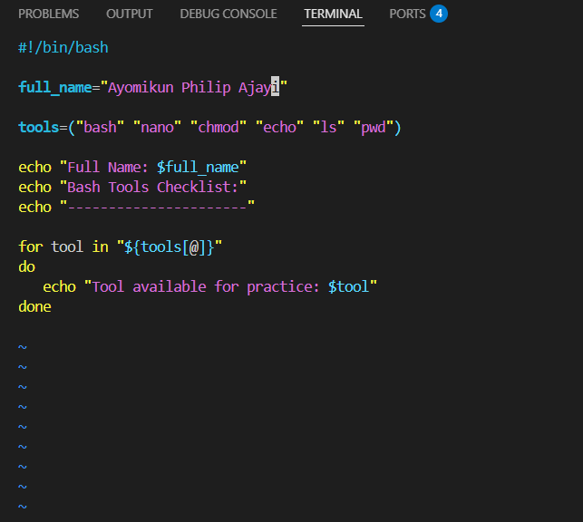

---

#### Screenshot 2 — Output of `./tools-checklist.sh`

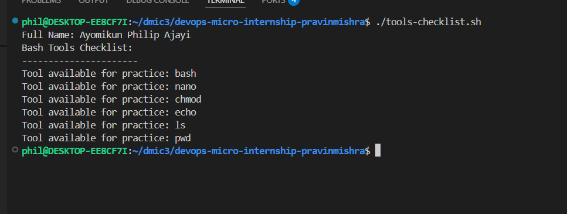

---

### Notes

Answer the following in your own words:

**1. What is an array in Bash?**

Unlike Variable that stores single value, Arrays store a list of value under one name.

---

**2. Why are arrays useful in scripts?**

Arrays are useful because they let you store multiple values in a single variable, making it easier to organize and process lists of data in a script.

---

**3. What does `"${tools[@]}"` mean?**

It means all the elements in the tools array.

---

**4. What is the purpose of the `for` loop in this script?**

The purpose of the for loop in this script is to repeat a block of commands for each item in the list or array, so you don't have to write the same code multiple times.

---

# Task 5 — Loops: Number Counter Script

## Goal

Use loops to repeat a task multiple times.

### Evidence

#### Screenshot 1 — Content of `counter.sh`

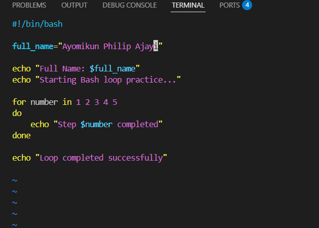

---

#### Screenshot 2 — Output of `./counter.sh`

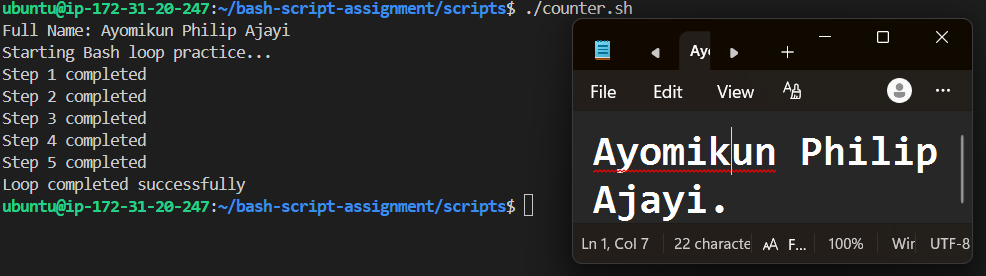

---

### Notes

Answer the following in your own words:

**1. What is a loop?**

A loop is a programming structure that repeats a set of commands until all items are processed or a condition is met.

---

**2. Why do we use loops in Bash scripting?**

To repeat tasks that involve repititions.

---

**3. How many times did the loop run in your script?**

Five times, because it contains five values

---

**4. What would you change if you wanted the loop to run 10 times?**

All i would do is add five more values, e.g: numbers 6 to 10

---

# Task 6 — Files & Conditionals: File Validation Script

## Goal

Use file checks and conditionals to verify whether files and directories exist.

### Evidence

#### Screenshot 1 — Output of `ls -lah ../test-folder`

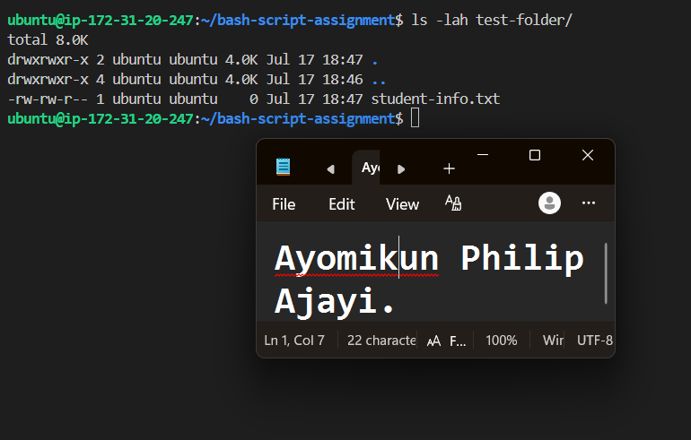

---

#### Screenshot 2 — Content of `file-check.sh`

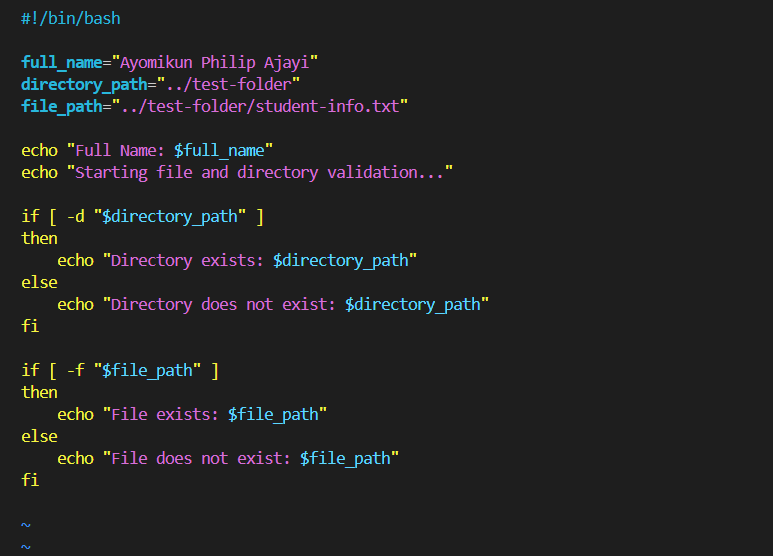

---

#### Screenshot 3 — Output of `./file-check.sh`

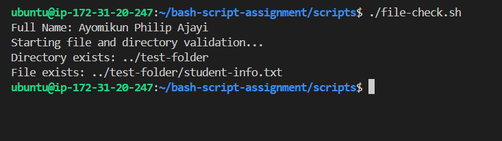

---

### Notes

Answer the following in your own words:

**1. What does `-d` check in Bash?**

In Bash, -d is a test operator that checks whether a path is a directory and it exists.

---

**2. What does `-f` check in Bash?**

-f is a test operator that checks whether a path is a regular file (not a directory).

---

**3. Why should file and directory paths be stored in variables?**

Storing file and directory paths in variables makes the script easier to read, update, and reuse, since you only need to change the path in one place instead of throughout the script.

---

**4. What happens if the file does not exist?**

If the file doesn't exist, the -f condition evaluates to false, so the else block is executed. As a result, the script displays the message:

File does not exist: ../test-folder/student-info.txt

---

# Task 7 — Conditionals: Pass or Retry Script

## Goal

Use if-else conditionals to make decisions based on a variable value.

### Evidence

#### Screenshot 1 — Content of `score-check.sh` with `score=85`

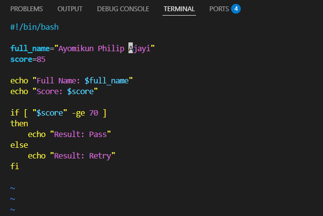

---

#### Screenshot 2 — Output showing `Result: Pass`

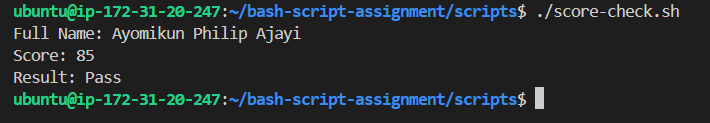

---

#### Screenshot 3 — Content of `score-check.sh` with `score=55`

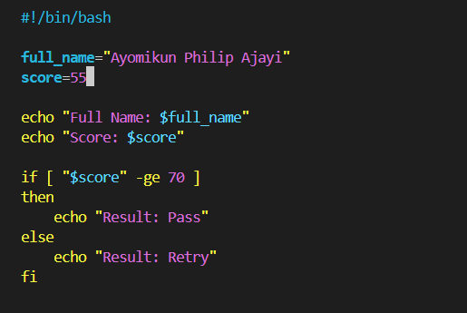

---

#### Screenshot 4 — Output showing `Result: Retry`

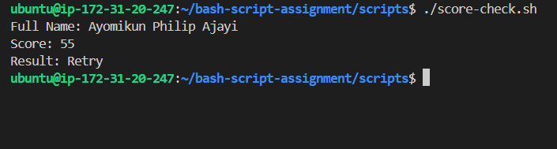

---

### Notes

Answer the following in your own words:

**1. What is the purpose of if-else in Bash?**

if-else statements allows the script to make its own decision.

---

**2. What does `-ge` mean?**

It means greater than or equal to.

---

**3. Why should conditions be tested with different values?**

To make sure that every possible outcomes work properly.

---

**4. How can conditionals help in automation scripts?**

Automation scripts use conditionals to make decisions instead of doing the same thing every time. They first check the current state of the system and then execute the appropriate commands.

---

# Task 8 — Functions: Final Bash Automation Script

## Goal

Create a final Bash script using functions to organize reusable code.

### Evidence

#### Screenshot 1 — Content of `final-automation.sh`

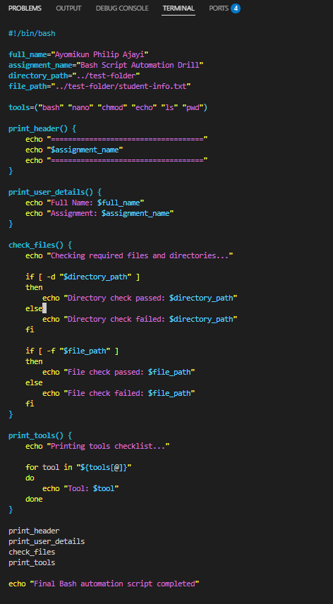

---

#### Screenshot 2 — Output of `./final-automation.sh`

---

#### Screenshot 3 — Output of `ls -lah` showing all created scripts

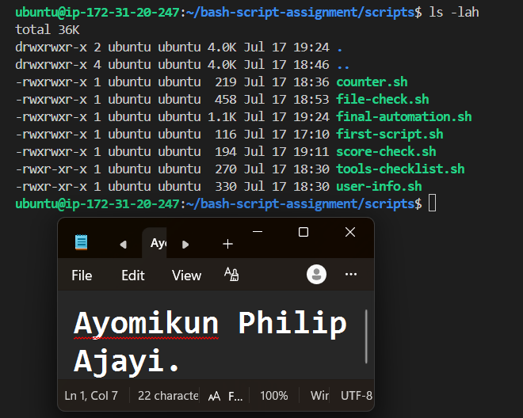

---

### Notes

Answer the following in your own words:

**1. What is a function in Bash?**

A function in Bash is a named block of commands that you can reuse whenever you need it, instead of writing the same code multiple times.

---

**2. Why are functions useful in scripts?**

Functions are useful because they reduce repetition, make scripts easier to read, and allow the same block of code to be reused whenever it's needed.

---

**3. Which functions did you create in this script?**

I created four functions in the script:

print_header displays the assignment header.
print_user_details displays my full name and the assignment title.
check_files checks if the required directory and file are available.
print_tools loops through the array and displays each tool one after another.

---

**4. How does this final script combine variables, arrays, loops, conditionals, files, and functions?**

The script combines different Bash concepts to complete the task. Variables are used to store my name, the assignment title, and the file and directory paths. An array stores the list of tools, while a loop goes through the array and displays each tool. Conditionals check whether the required directory and file exist before displaying the appropriate message. The script is also divided into functions, making it more organized, reusable, and easier to follow.

---

# LinkedIn Post (Required)

## Evidence

#### LinkedIn Post URL

Paste your LinkedIn post URL here:

`https://www.linkedin.com/posts/ayomikunphilip_dmibypravinmishra-devops-linux-ugcPost-7483972773447614464-rBO_/?utm_source=social_share_send&utm_medium=member_desktop_web&rcm=ACoAAF4cLMMBGj_ND3_b5bGU28ywvq8aZAW62fs`

---

#### Screenshot — Published LinkedIn post

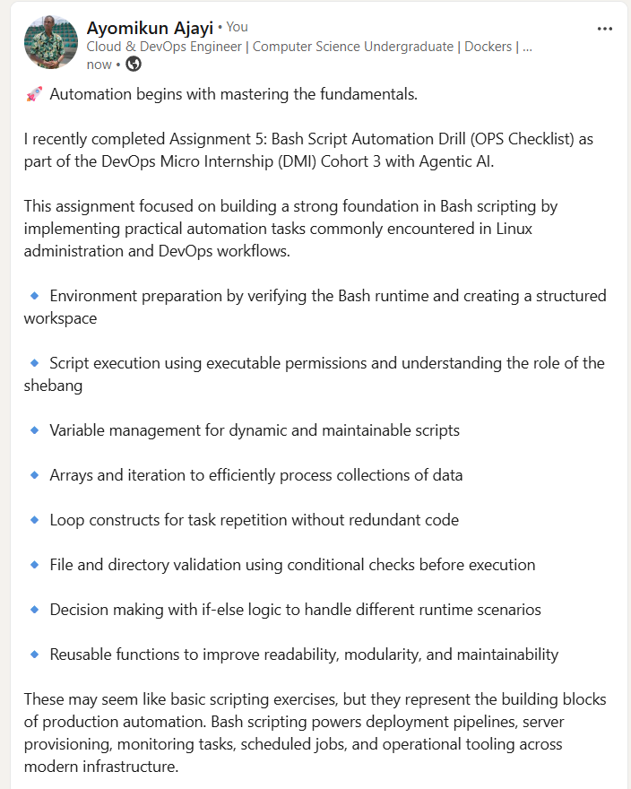

---

# Submission Instructions

- Add all required screenshots in your submission
- Full name must be visible in required screenshots
- All script files must be created and run successfully
- Required notes must be answered clearly for every task
- Do not expose sensitive information (keys, passwords, credentials)

---

# Completion Checklist

- [ ] Task 1: Environment setup verified, workspace created (Screenshots 1–2, Notes answered)
- [ ] Task 2: First script created, executed, permissions verified (Screenshots 1–3, Notes answered)
- [ ] Task 3: Variables script created and run (Screenshots 1–2, Notes answered)
- [ ] Task 4: Arrays and loops script created and run (Screenshots 1–2, Notes answered)
- [ ] Task 5: Counter loop script created and run (Screenshots 1–2, Notes answered)
- [ ] Task 6: File validation script created and run (Screenshots 1–3, Notes answered)
- [ ] Task 7: Pass/Retry conditional script tested with both values (Screenshots 1–4, Notes answered)
- [ ] Task 8: Final automation script created and run (Screenshots 1–3, Notes answered)
- [ ] All scripts run without errors
- [ ] Full Name visible in all required screenshots
- [ ] LinkedIn post published and URL submitted
- [ ] No sensitive data exposed

---

## 📌 About DMI & CloudAdvisory

DevOps Micro Internship (DMI) is a project-based DevOps program run by Pravin Mishra (The CloudAdvisory) focused on real-world execution, systems thinking, and career readiness.

It helps learners build strong DevOps foundations with hands-on experience.

---

## 📌 Resources

- 🌐 DMI Official Website: https://pravinmishra.com/dmi  
- 🎓 DevOps for Beginners (Udemy): https://www.udemy.com/course/devops-for-beginners-docker-k8s-cloud-cicd-4-projects/  
- 🎓 Agentic AI DevOps with Claude Code: https://www.udemy.com/course/ultimate-agentic-ai-devops-with-claude-code/  
- 🎓 DevOps with Claude Code: Terraform, EKS, ArgoCD & Helm: https://www.udemy.com/course/devops-with-claude-code-terraform-eks-argocd-helm/  
- ▶️ YouTube Playlist: https://www.youtube.com/playlist?list=PLFeSNDtI4Cho  
- 🔗 Pravin Mishra (LinkedIn): https://www.linkedin.com/in/pravin-mishra-aws-trainer/  
- 🏢 CloudAdvisory (LinkedIn): https://www.linkedin.com/company/thecloudadvisory/

---

*This submission is part of DevOps Micro Internship (DMI) Cohort 3 — Agentic AI Track.*