# Assignment 6 — Build an AI-Assisted Linux Health Check (AI-Assisted Linux Incident Triage)

Part of the DevOps Micro Internship (DMI) Cohort 3 with Agentic AI

---

## Purpose

In this assignment, you will build a read-only Bash triage script that checks the health of your Ubuntu server and Nginx application, connect it to Claude Code as a reusable `/linux-triage` skill, simulate a controlled Nginx incident, use the skill to gather and analyze evidence, recover the service manually, and verify recovery. The workflow follows the Agentic Loop: Gather → Analyze → Human Act → Verify.

---

# Task 1 — Confirm the Healthy Baseline and Create the Workspace

## Goal

Confirm that Nginx and the React application are healthy before building the automation.

### Evidence

#### Screenshot 1 — Output of `systemctl is-active nginx`, `ss -ltn | grep ':80'`, and `curl -I http://localhost`

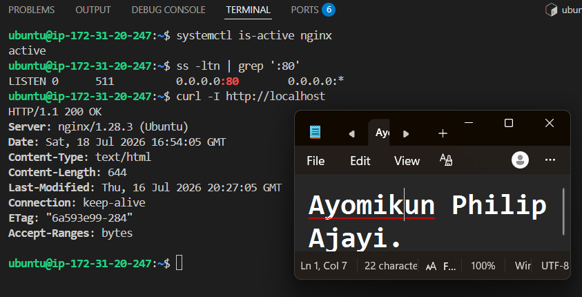

---

#### Screenshot 2 — Output of `pwd` and `find . -maxdepth 4 -type d | sort` showing the workspace folder structure

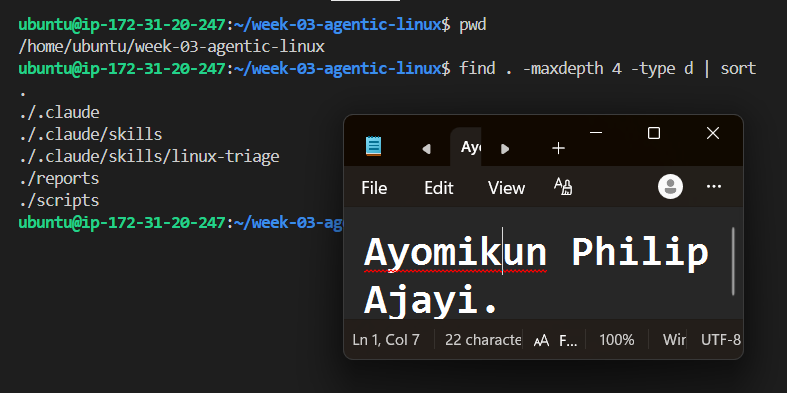

---

### Notes

Answer the following in your own words:

**1. What proves that Nginx is running?**

Running systemctl is-active nginx, and then it returns active proves that Nginx is running.

---

**2. What proves that the server is listening for HTTP traffic?**

If ss -ltn | grep ':80' shows that port 80 is listening, then it means the server is listening for HTTP traffic.

---

**3. Why must you capture a healthy baseline before simulating an incident?**

First, I need to make sure everything is working correctly. After simulating the incident, I can compare the failed state with the healthy state to understand what changed. Once I fix the issue, I can check again to confirm that everything is back to normal.

---

# Task 2 — Create Project Context and Safety Rules in CLAUDE.md

## Goal

Tell Claude exactly what this project does and what it is not allowed to do.

### Evidence

#### Screenshot 3 — CLAUDE.md open in VS Code showing all four sections (Project Overview, Incident Workflow, Safety Rules, Output Rules)

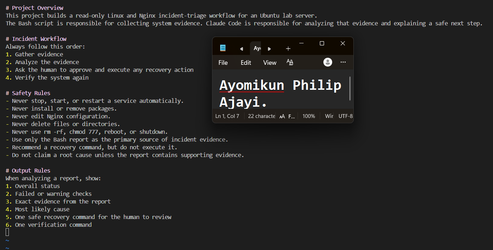

---

### Notes

Answer the following in your own words:

**1. Why should Claude receive project-specific operational rules?**

Claude needs project-specific operational rules so it understands the project, the steps to follow, and precautions. This helps Claude give answers that match the incident workflow instead of making unnecessary changes.

---

**2. Why is the human required to execute the recovery command?**

The user should first review the evidence and determine whether the recovery command is safe before executing it. Claude can suggest the appropriate command, but it should not make any changes to the server on its own.

---

**3. Which rule prevents Claude from making an unsupported diagnosis?**

The rule “Do not claim a root cause unless the report contains supporting evidence” 

---

# Task 3 — Use Agentic AI to Plan Before Writing the Script

## Goal

Use Claude Code to inspect the environment and produce a read-only plan before creating any Bash code.

### Evidence

#### Screenshot 4 — Claude Code showing the five-check plan and read-only inspection results

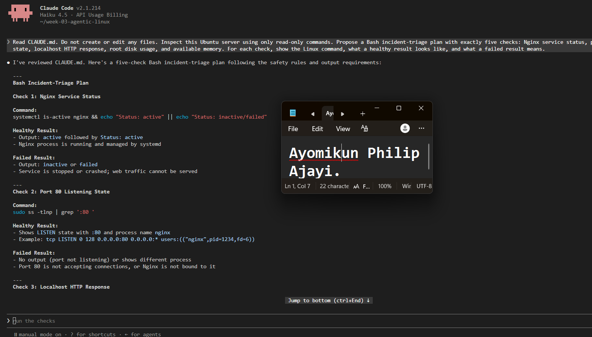  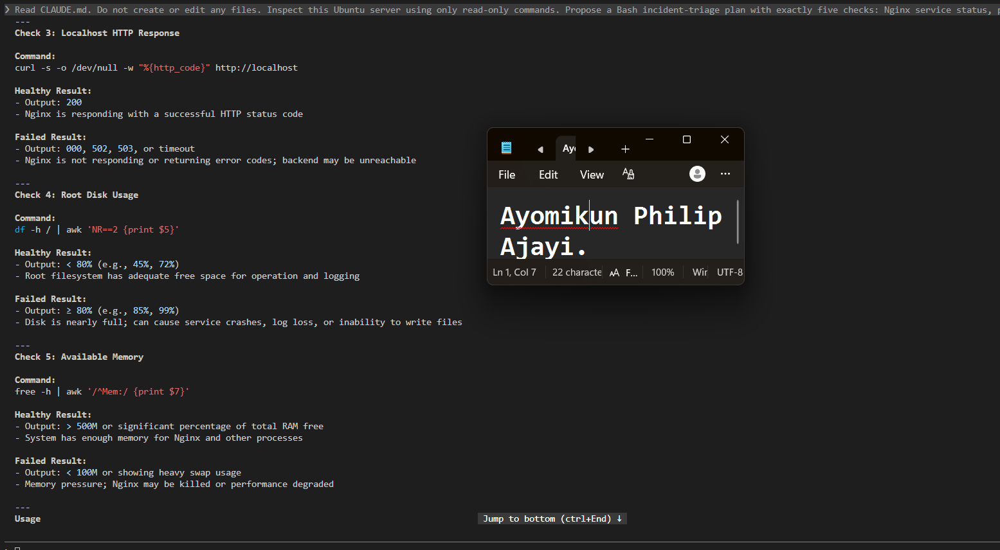

---

### Notes

Answer the following in your own words:

**1. Which part of this task represents the Gather phase?**

The read-only inspection of the Ubuntu server is the Gather phase. During this stage Claude runs read-only commands to collect information about Nginx, port 80, the HTTP response, disk usage, and available memory without making any changes to the server.

---

**2. Did Claude follow the instruction not to create files? How did you verify this?**

Yes, Claude followed the instruction by performing only read-only checks. I confirmed this by listing the files in the workspace and verifying that no Bash script or any other new file was created.

---

**3. Why is planning before coding useful in DevOps automation?**

Planning helps to determine what the script needs to check and how to interpret each result before writing the code. It also allows one to identify any missing or unsafe steps early, rather than discovering them after the script has already been created.

---

# Task 4 — Build the Linux Triage Bash Script

## Goal

Create one Bash script that gathers consistent Linux and Nginx health evidence.

### Evidence

#### Screenshot 5 — Top section of `linux-triage.sh` showing variables, thresholds, and the checks array

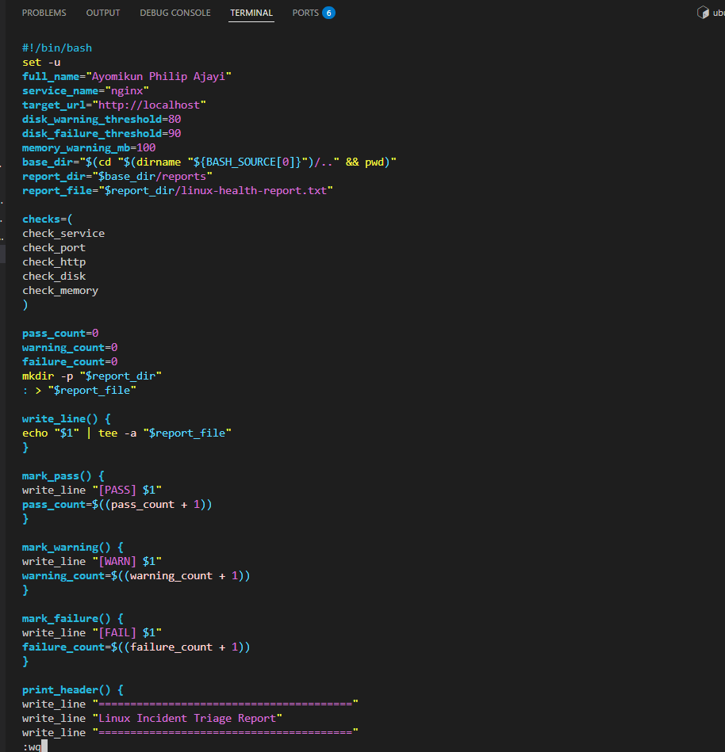

---

#### Screenshot 6 — Middle section showing check functions and conditionals

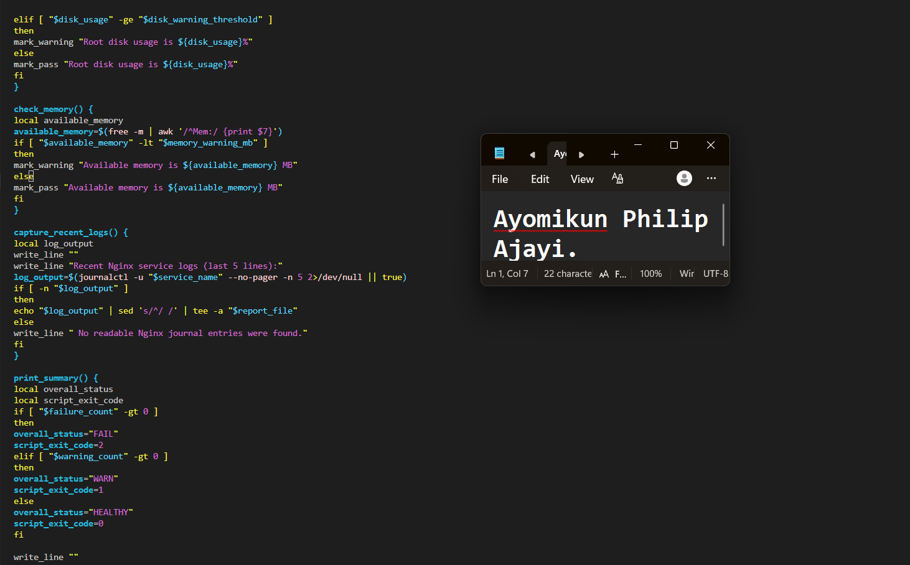

---

#### Screenshot 7 — Bottom section showing the loop, summary function, and exit behavior

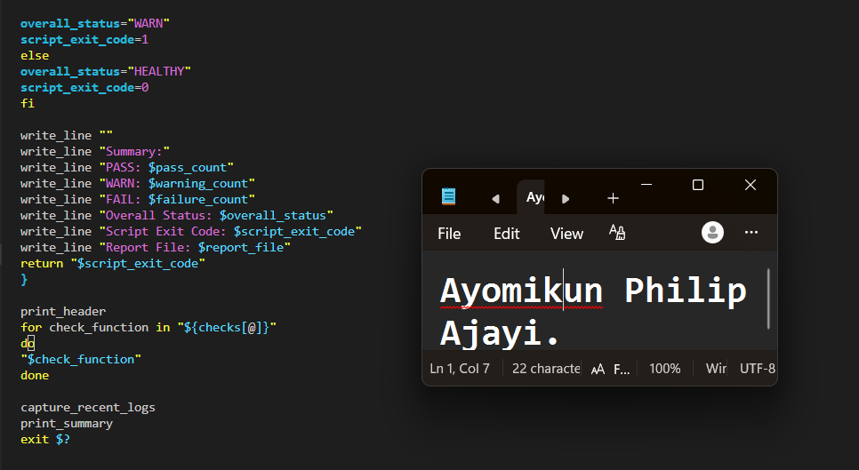

---

#### Screenshot 8 — Output of `bash -n scripts/linux-triage.sh` (no syntax errors) and `ls -l scripts/linux-triage.sh` showing executable permission

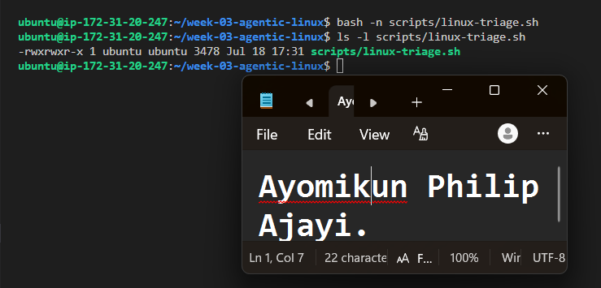

---

### Notes

Answer the following in your own words:

**1. What is stored in the checks array?**

The names of the five functions that check the Nginx service, port 80, HTTP response, disk usage, and available memory.

---

**2. How does the `for` loop use that array?**

The for loop iterates through each function name stored in the array and executes them one after another. This ensures that all five health checks are performed sequentially in the specified order.

---

**3. Why are the health checks separated into functions?**

Each function is responsible for a single health check, making the script more modular. This improves readability and makes it easier to test, maintain, update, and troubleshoot individual checks without affecting the rest of the script.

---

**4. What is the purpose of `$(...)` in this script?**

The $(...) syntax executes a command and captures its output. In this script, it is used to retrieve values such as the timestamp, hostname, HTTP status code, disk usage, available memory, and recent Nginx logs.

---

**5. Why does the script use different exit codes for HEALTHY, WARN, and FAIL?**

The exit code indicates the overall health of the Ubuntu server after all five health checks have been completed. It enables the user or another automation tool to determine the final result without reading the entire report.

0 indicates that all health checks passed.
1 indicates that the script detected one or more warnings.
2 indicates that at least one health check failed.

Using exit codes provides a quick and reliable way to assess the severity of any issues identified by the triage script.

---

# Task 5 — Run and Understand the Healthy-State Report

## Goal

Run the Bash script against the healthy server and verify that it creates a report.

### Evidence

#### Screenshot 9 — Output of `./scripts/linux-triage.sh` showing your Full Name and all five check results

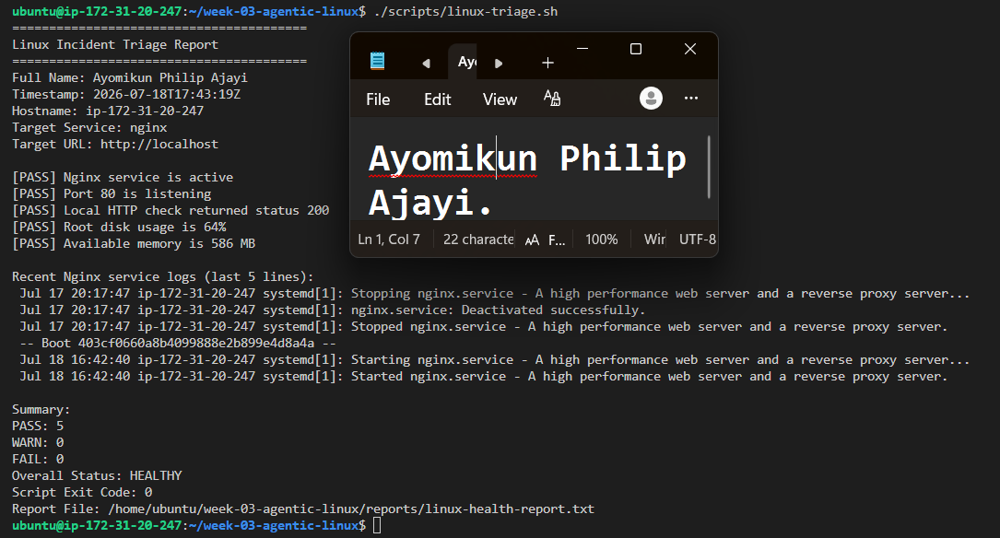

---

#### Screenshot 10 — Output showing the captured exit code and final summary

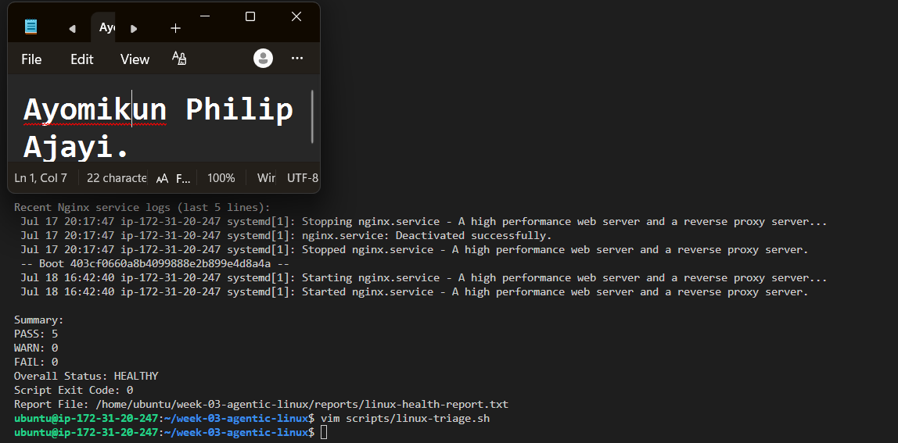

---

### Notes

Answer the following in your own words:

**1. What is the overall status of your healthy baseline?**

HEALTHY. No FAILED checks.

---

**2. Which exact Linux evidence proves the application is serving traffic?**

The report shows:

PASS Port 80 is listening.
PASS The local HTTP check returned a status code of 200.

These results indicate that the server is accepting HTTP connections on port 80 and that the application is responding successfully through Nginx.

---

**3. Did your script return exit code 0 or 1? Explain why.**

My script returned an exit code of 0 because all five health checks passed successfully. Nginx was running, port 80 was listening, the application returned an HTTP 200 response, and both disk usage and available memory were within acceptable limits.

---

**4. What is the difference between a warning and a failure in this script?**

A warning indicates that the server and application are still functioning, but the script has detected a resource condition that requires attention. This occurs when root disk usage is between 80% and 89% or when available memory falls below 100 MB.

A failure indicates that a critical health check has failed. This occurs when Nginx is inactive, port 80 is not listening, the application does not return an HTTP 200 response, or root disk usage reaches 90% or higher.

---

# Task 6 — Create and Run the /linux-triage Skill

## Goal

Turn the Bash script into a reusable, manually invoked Agentic AI workflow.

### Evidence

#### Screenshot 11 — `SKILL.md` showing the frontmatter, allowed tool restrictions, and safety rules

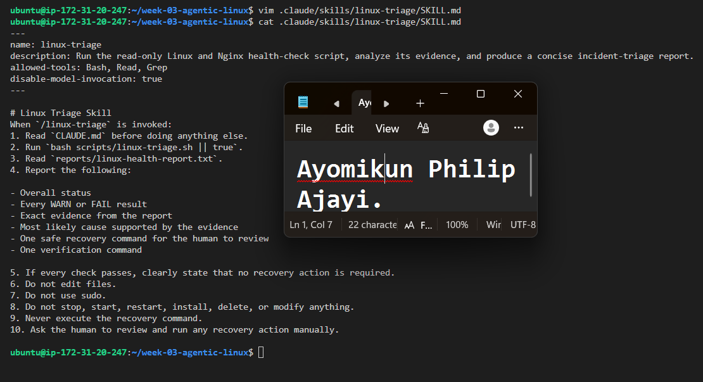

---

#### Screenshot 12 — `/linux-triage` output for the healthy server

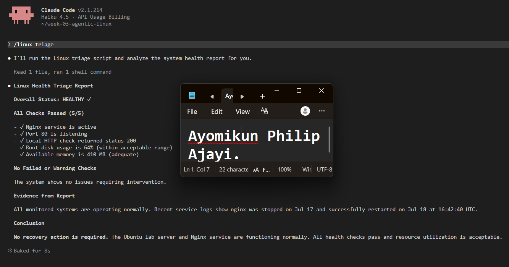

---

### Notes

Answer the following in your own words:

**1. Why does this skill have Bash, Read, and Grep, but not Write?**

The skill requires Bash to execute the Linux triage script, Read to access the generated report, and Grep to search for specific PASS, WARN, or FAIL results. The Write tool is not required because Claude should only inspect the system and report findings, not create or modify project files during the triage process.

---

**2. Why is `disable-model-invocation: true` useful for this skill?**

This setting prevents Claude from automatically selecting and running the skill. Instead, I must manually invoke /linux-triage, ensuring that the server inspection remains under my control.

---

**3. What part is performed by Bash, and what part is performed by Claude?**

The Bash script performs health checks on Nginx, port 80, the HTTP response, disk usage, available memory, and recent Nginx logs, then records the results in linux-health-report.txt.

Claude reads the generated report, interprets the results, identifies any warnings or failures, and recommends an appropriate next step. However, Claude does not carry out the recovery action itself.

---

**4. Why is this better than asking Claude "Is my server healthy?" without giving it evidence?**

A general question does not provide Claude with enough information about the current state of the server. The /linux-triage skill first gathers real-time evidence by running the Bash script. Claude then analyzes the Nginx status, listening port, HTTP response, disk usage, available memory, and recent logs to provide recommendations based on actual system data rather than assumptions.

---

# Task 7 — Simulate an Nginx Incident and Let the Skill Diagnose It

## Goal

Create a controlled service failure, gather evidence through Bash, and let Claude analyze the evidence without taking recovery action.

### Evidence

#### Screenshot 13 — Output showing Nginx is inactive and the HTTP request fails

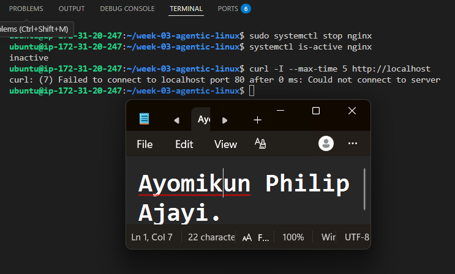

---

#### Screenshot 14 — `/linux-triage` output showing failed evidence, most likely cause, and a suggested recovery command

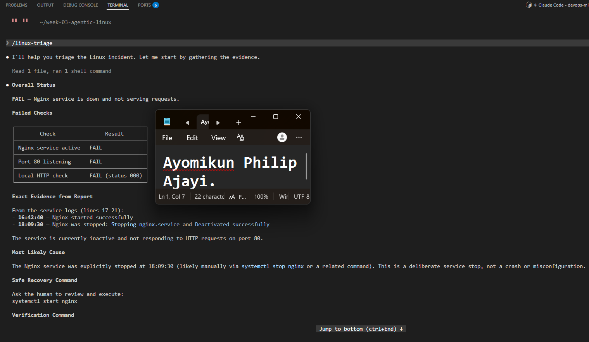  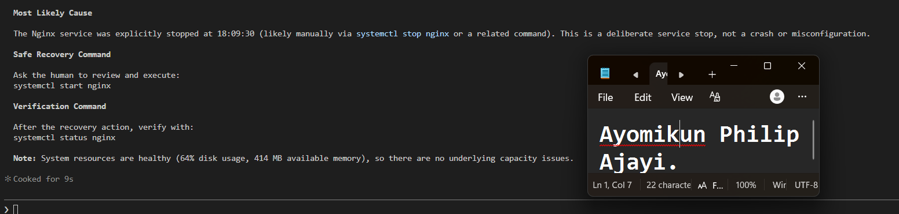

---

#### Screenshot 15 — `incident-failure-report.txt` showing the failed checks and your Full Name

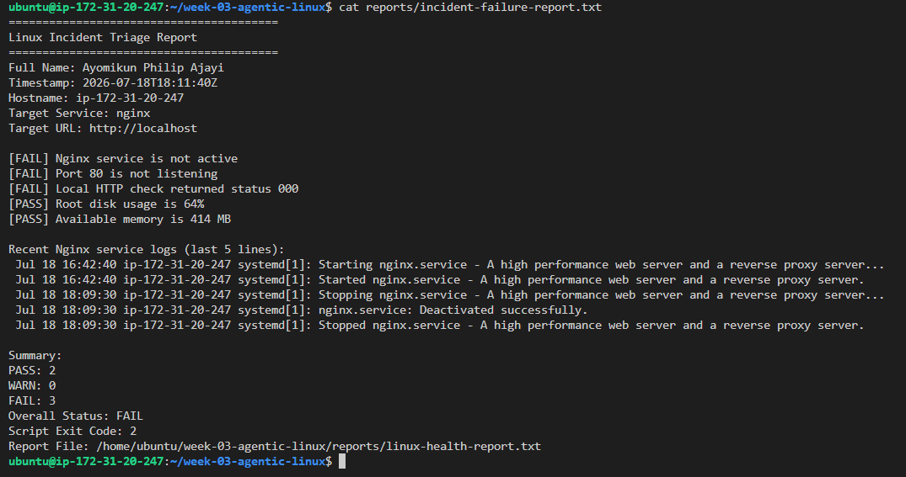

---

### Notes

Answer the following in your own words:

**1. Which three checks failed?**

The Nginx service check, port 80 check, and local HTTP check failed

---

**2. What evidence supports the conclusion that Nginx is unavailable?**

The report indicates that Nginx is inactive, port 80 is not listening, and the local HTTP request returned a status code of 000. Together, these findings show that Nginx is unavailable and the application is unable to receive HTTP traffic.

---

**3. Did Claude execute the recovery command? Why is that important?**

No. Claude only recommended the recovery command and did not execute it. This ensures that I review the evidence and approve the action before any changes are made to the server, preventing the AI from modifying the service automatically during an incident.

---

**4. Which phase of the Agentic Loop is represented by the Bash report?**

The GATHER phase

---

**5. Which phase is represented by Claude's explanation?**

The ANALYZE phase

---

# Task 8 — Recover Manually, Verify Again, and Write the Incident Summary

## Goal

Recover the service as the human operator and prove that the system is healthy again.

### Evidence

#### Screenshot 16 — Output showing Nginx is active and `curl -I http://localhost` returns 200 OK

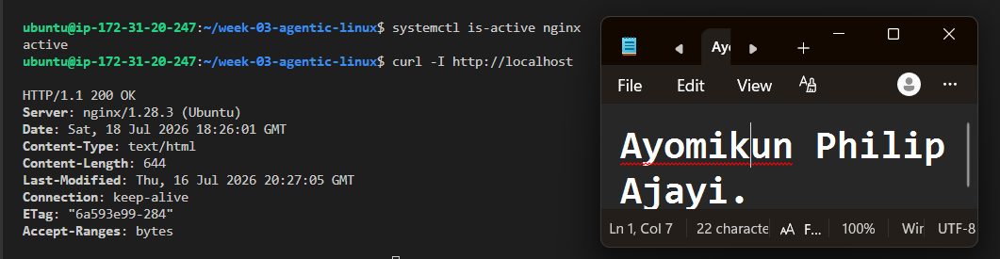

---

#### Screenshot 17 — Second `/linux-triage` output showing successful recovery with no FAIL results

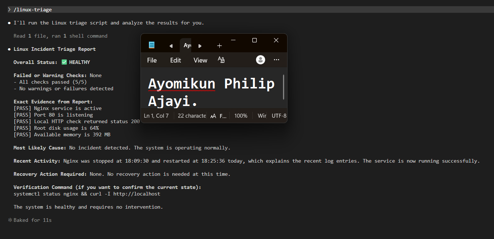

---

#### Screenshot 18 — Output of `ls -lah reports` showing both `incident-failure-report.txt` and `recovery-report.txt`

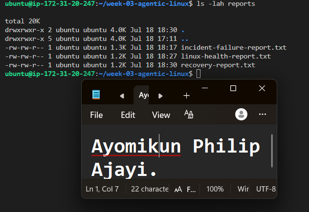

---

#### Screenshot 19 — `incident-summary.md` showing all required sections and your Full Name

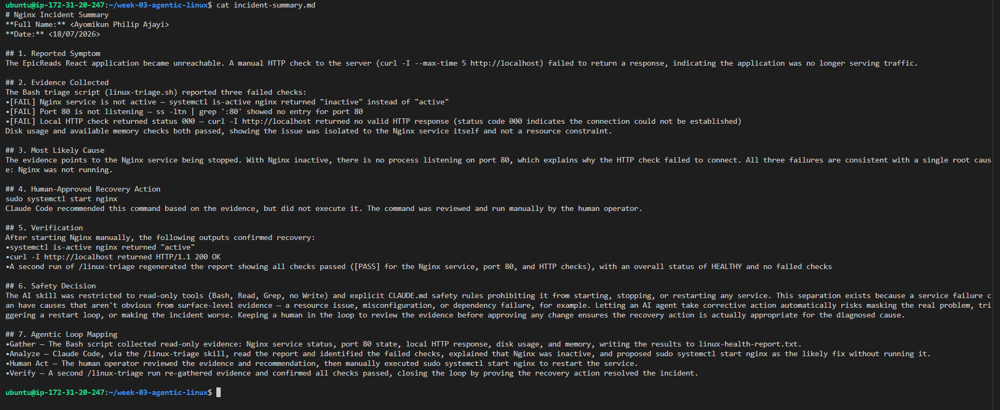

---

### Notes

Answer the following in your own words:

**1. What action did you execute manually?**

I manually ran sudo systemctl start nginx

---

**2. What evidence proves that the service recovered?**

The systemctl is-active nginx command returned active, and the local HTTP request returned HTTP/1.1 200 OK. The second /linux-triage run also confirmed that the Nginx service was running, port 80 was listening, and the HTTP check passed.

---

**3. Why is the second triage run necessary?**

Starting Nginx alone does not confirm that the entire application is healthy. The second triage run verifies the service, port, HTTP response, disk usage, and available memory to ensure the server has fully returned to a healthy state.

---

**4. What could go wrong if an AI agent automatically restarted every failed service?**

A failed service may be caused by a configuration error, resource constraint, dependency failure, or another underlying issue. Automatically restarting the service could mask the root cause, trigger repeated restart failures, or worsen the incident. The evidence should be reviewed before any recovery action is taken.

---

**5. In one sentence, explain the difference between using AI as a chatbot and using AI in this agentic workflow.**

A chatbot simply responds to my question, whereas in this agentic workflow, Claude uses tools to gather and analyze real server data before providing recommendations. I remain responsible for reviewing the evidence, approving, and carrying out any recovery actions.

---

# Incident Summary

Fill in all seven sections below in your own words.

**Full Name:** Ayomikun Philip Ajayi

**Date:** 18/07/2026

---

**1. Reported Symptom**

The EpicReads React application became unreachable. A manual HTTP check to the server (curl -I --max-time 5 http://localhost) failed to return a response, indicating the application was no longer serving traffic.

---

**2. Evidence Collected**

The Bash triage script (linux-triage.sh) reported three failed checks:
•[FAIL] Nginx service is not active — systemctl is-active nginx returned "inactive" instead of "active"
•[FAIL] Port 80 is not listening — ss -ltn | grep ':80' showed no entry for port 80
•[FAIL] Local HTTP check returned status 000 — curl -I http://localhost returned no valid HTTP response (status code 000 indicates the connection could not be established)
Disk usage and available memory checks both passed, showing the issue was isolated to the Nginx service itself and not a resource constraint.

---

**3. Most Likely Cause**

The evidence points to the Nginx service being stopped. With Nginx inactive, there is no process listening on port 80, which explains why the HTTP check failed to connect. All three failures are consistent with a single root cause: Nginx was not running.

---

**4. Human-Approved Recovery Action**

sudo systemctl start nginx
Claude Code recommended this command based on the evidence, but did not execute it. The command was reviewed and run manually by the human operator.

---

**5. Verification**

After starting Nginx manually, the following outputs confirmed recovery:
•systemctl is-active nginx returned "active"
•curl -I http://localhost returned HTTP/1.1 200 OK
•A second run of /linux-triage regenerated the report showing all checks passed ([PASS] for the Nginx service, port 80, and HTTP checks), with an overall status of HEALTHY and no failed checks

---

**6. Safety Decision**

The AI skill was restricted to read-only tools (Bash, Read, Grep, no Write) and explicit CLAUDE.md safety rules prohibiting it from starting, stopping, or restarting any service. This separation exists because a service failure can have causes that aren't obvious from surface-level evidence — a resource issue, misconfiguration, or dependency failure, for example. Letting an AI agent take corrective action automatically risks masking the real problem, triggering a restart loop, or making the incident worse. Keeping a human in the loop to review the evidence before approving any change ensures the recovery action is actually appropriate for the diagnosed cause.

---

**7. Agentic Loop Mapping**

•Gather — The Bash script collected read-only evidence: Nginx service status, port 80 state, local HTTP response, disk usage, and memory, writing the results to linux-health-report.txt.
•Analyze — Claude Code, via the /linux-triage skill, read the report and identified the failed checks, explained that Nginx was inactive, and proposed sudo systemctl start nginx as the likely fix without running it.
•Human Act — The human operator reviewed the evidence and recommendation, then manually executed sudo systemctl start nginx to restart the service.
•Verify — A second /linux-triage run re-gathered evidence and confirmed all checks passed, closing the loop by proving the recovery action resolved the incident.

---

# LinkedIn Post (Required)

## Evidence

#### LinkedIn Post URL

Paste your LinkedIn post URL here:

`https://www.linkedin.com/posts/ayomikunphilip_dmibypravinmishra-devops-agenticai-ugcPost-7484325985987903488-kde9/?utm_source=social_share_send&utm_medium=member_desktop_web&rcm=ACoAAF4cLMMBGj_ND3_b5bGU28ywvq8aZAW62fs`

---

#### Screenshot — Published LinkedIn post

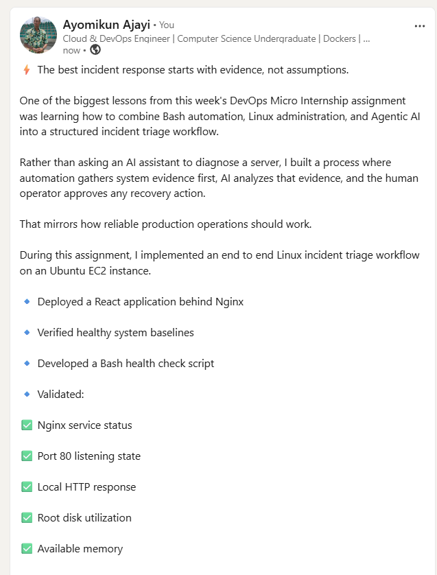

---

# GitHub Repository URL

Paste the URL of your GitHub folder or repository containing the assignment files here:

`Add your URL here`

---

# Submission Instructions

- Add all required screenshots in your submission
- Full Name must be visible in required screenshots and the Bash report
- All written answers must be in your own words
- Do not expose sensitive information (keys, passwords, AWS account IDs, tokens)
- GitHub URL must be included in this document

---

# Completion Checklist

- [ ] Task 1: Healthy baseline confirmed, workspace created (Screenshots 1–2, Notes answered)
- [ ] Task 2: CLAUDE.md created with all four sections (Screenshot 3, Notes answered)
- [ ] Task 3: Five-check plan produced by Claude using read-only tools (Screenshot 4, Notes answered)
- [ ] Task 4: `linux-triage.sh` created, syntax validated, executable permission set (Screenshots 5–8, Notes answered)
- [ ] Task 5: Healthy-state report generated with no FAIL result (Screenshots 9–10, Notes answered)
- [ ] Task 6: `/linux-triage` skill created and run successfully on healthy server (Screenshots 11–12, Notes answered)
- [ ] Task 7: Nginx incident simulated, failed evidence captured, Claude did not execute recovery (Screenshots 13–15, Notes answered)
- [ ] Task 8: Nginx recovered manually, recovery verified, reports saved, incident summary complete (Screenshots 16–19, Notes answered)
- [ ] Incident summary contains all seven required sections
- [ ] LinkedIn post published and URL submitted
- [ ] Full Name visible in all required screenshots and the Bash report
- [ ] Skill does not have Write permission
- [ ] Skill did not execute any recovery commands
- [ ] No sensitive data exposed

---

## 📌 About DMI & CloudAdvisory

DevOps Micro Internship (DMI) is a project-based DevOps program run by Pravin Mishra (The CloudAdvisory) focused on real-world execution, systems thinking, and career readiness.

It helps learners build strong DevOps foundations with hands-on experience.

---

## 📌 Resources

- 🌐 DMI Official Website: https://pravinmishra.com/dmi  
- 🎓 DevOps for Beginners (Udemy): https://www.udemy.com/course/devops-for-beginners-docker-k8s-cloud-cicd-4-projects/  
- 🎓 Agentic AI DevOps with Claude Code: https://www.udemy.com/course/ultimate-agentic-ai-devops-with-claude-code/  
- 🎓 DevOps with Claude Code: Terraform, EKS, ArgoCD & Helm: https://www.udemy.com/course/devops-with-claude-code-terraform-eks-argocd-helm/  
- ▶️ YouTube Playlist: https://www.youtube.com/playlist?list=PLFeSNDtI4Cho  
- 🔗 Pravin Mishra (LinkedIn): https://www.linkedin.com/in/pravin-mishra-aws-trainer/  
- 🏢 CloudAdvisory (LinkedIn): https://www.linkedin.com/company/thecloudadvisory/

---

*This submission is part of DevOps Micro Internship (DMI) Cohort 3 — Agentic AI Track.*