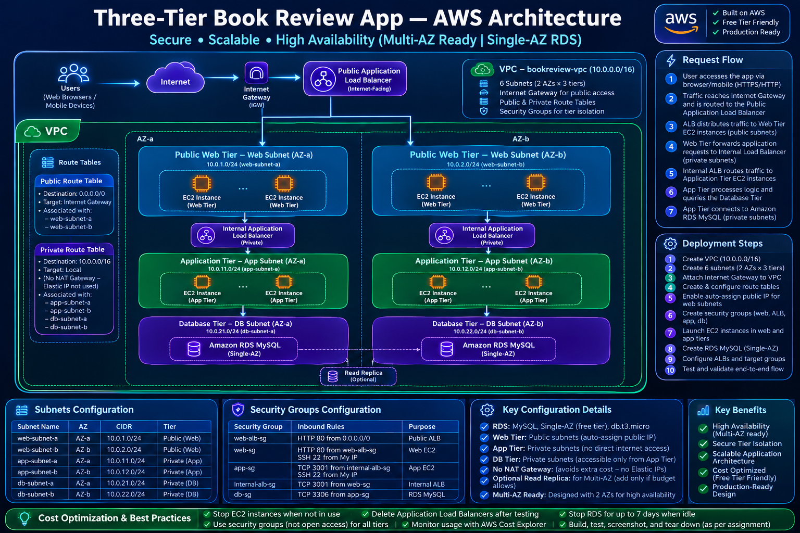
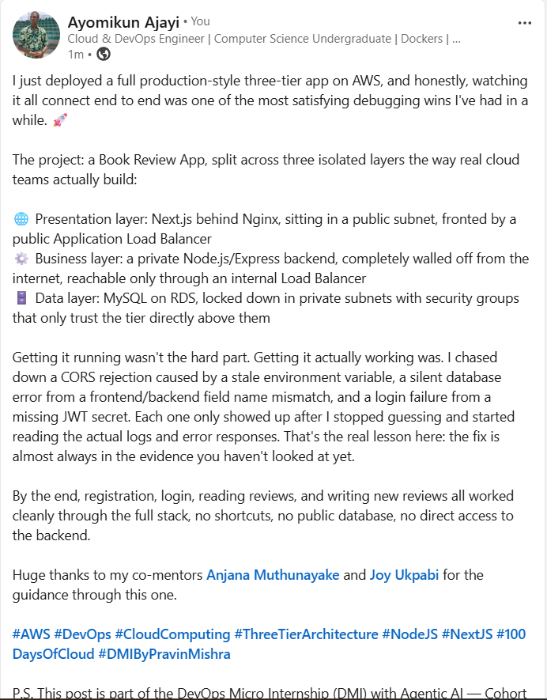

# Assignment 6 — Capstone Assignment — Deploy Book Review App (Three-Tier Architecture) on AWS

Part of the DevOps Micro Internship (DMI) Cohort 3 with Agentic AI

---

## Purpose

This is the most important assignment of the course. You will deploy the Book Review App in a fully production-style three-tier architecture on AWS: a Next.js Web Tier behind Nginx and a public ALB, a private Node.js/Express App Tier behind an internal ALB, and a private Multi-AZ MySQL RDS database with a read replica. You are expected to design, deploy, isolate, debug, and document the result independently.

---

# Task 1 — Architecture Diagram

## Goal

Create an architecture diagram showing the custom VPC (10.0.0.0/16), the six subnets across two Availability Zones (two public Web Tier, two private App Tier, two private Database Tier), the public ALB, Web Tier EC2/Nginx, internal ALB, private App Tier EC2, private Multi-AZ RDS with its read replica, and the permitted traffic flow.

### Evidence

#### Diagram image or link

---

# Task 2 — AWS Region & Services Used

## Goal

Record the AWS Region used and list every AWS service used across networking, compute, load balancing, security, and the database.

### Notes

**Region:**

us-east-1 (N. Virginia)

---

**Services:**

VPC (Virtual Private Cloud)
Subnets (6 total: 2 public, 4 private)
Internet Gateway
Route Tables (Public + Private)
EC2 Instances (2: Web Tier + App Tier)
Application Load Balancer (2: Public + Internal)
Security Groups (5: web-alb-sg, web-sg, internal-alb-sg, app-sg, db-sg)
RDS MySQL (Single-AZ)
NAT Gateway (temporary, for package installation — deleted)

---

# Task 3 — Public Entry Point

## Goal

Confirm the Book Review App loads through the public ALB DNS name.

### Evidence

#### Public ALB DNS

Paste your public ALB DNS name here:

`bookreview-public-alb-636138120.us-east-1.elb.amazonaws.com`

---

# Task 4 — Evidence Screenshots

## Goal

Capture visual proof of every tier and load balancer.

### Evidence

#### Web EC2

---

#### App EC2

---

#### Public ALB

---

#### Internal ALB

---

#### RDS + Replica

---

#### App UI proof

---

# Task 5 — Summary

## Goal

Summarize what worked in the final deployment, the issues encountered and how each was fixed, and the tools or sources used to research and debug.

### Notes

**What worked:**

Three-tier architecture successfully isolated Web, App, and Database tiers across two AZs using security groups and subnets
Both public and internal load balancers correctly distributed traffic and maintained target health
End-to-end traffic flow validated: Internet → Public ALB → Nginx reverse proxy → Internal ALB → Express backend → RDS MySQL
RDS single-AZ deployment kept costs within free-tier budget while maintaining database availability
EC2 instances in private subnets verified secure isolation without public IP exposure

---

**Issues + fixes:**

1. App Tier outbound connectivity (Session Manager hanging) — Fixed by creating three VPC Interface Endpoints (ssm, ssmmessages, ec2messages) to enable private, secure access without internet gateway
2. NAT Gateway temporary internet access — Created temporary NAT Gateway in public subnet with route in private-rt for package installation; deleted post-installation to avoid Elastic IP charges and comply with assignment rules
3. Security group port 80 rule confusion — Initially tried to test direct public IP access; realized web-sg correctly only allows port 80 from web-alb-sg, not from the internet — fixed by testing through the public ALB instead
4. Frontend API routing issue (/api/api/books) — Backend .env had wrong ALLOWED_ORIGINS pointing only to localhost, blocking cross-origin requests; added public ALB DNS to CORS whitelist. Later discovered hardcoded /api/ prefix in page.js that doubled the path — fixed by removing the redundant prefix
5. Internal ALB security group missing port 80 rule — internal-alb-sg initially only had port 3001 rule; added HTTP port 80 inbound from web-sg to allow Nginx reverse proxy to reach it
6. Nginx proxy path routing — Added location /api/ block to forward requests to internal ALB; updated frontend .env.local to use relative path /api instead of hardcoded internal ALB URL so browser could reach the app

---

**Tools/sources used:**

AWS Console (VPC, EC2, RDS, Load Balancers, Security Groups)
Claude AI (architecture guidance, debugging, code fixes)
Vim (config file editing on EC2)
Session Manager (secure terminal access to private instances)
Browser DevTools (Network tab for diagnosing API errors)
Git (cloning app repository)
npm (package management for Node.js/Next.js)
pm2 (process management for persistent app running)

---

# LinkedIn Post (Required)

## Goal

Publish a LinkedIn post sharing the capstone deployment, including the public ALB DNS (or a redacted screenshot), three to five lines on what you built and why it is production-style, and one proof screenshot.

## Evidence

#### LinkedIn Post URL

Paste your LinkedIn post URL here:

`https://www.linkedin.com/posts/ayomikunphilip_aws-devops-cloudcomputing-activity-7495426997729513473-lIla?utm_source=social_share_send&utm_medium=member_desktop_web&rcm=ACoAAF4cLMMBGj_ND3_b5bGU28ywvq8aZAW62fs`

---

#### Screenshot of LinkedIn post

---

# Submission Instructions

- Add all required screenshots and links in your submission
- Do not expose passwords, RDS credentials, connection strings, private keys, or account IDs

---

# Completion Checklist

- [ ] Task 1: Architecture diagram completed
- [ ] Task 2: AWS Region and services documented
- [ ] Task 3: Public ALB DNS confirmed working
- [ ] Task 4: All six evidence screenshots captured (Web Tier, App Tier, both ALBs, RDS + replica, app UI)
- [ ] Task 5: Deployment summary completed (what worked, issues/fixes, tools/sources)
- [ ] LinkedIn post published and URL submitted
- [ ] App Tier and Database Tier confirmed not publicly accessible
- [ ] No sensitive data exposed

---

## 📌 About DMI & CloudAdvisory

DevOps Micro Internship (DMI) is a project-based DevOps program run by Pravin Mishra (The CloudAdvisory) focused on real-world execution, systems thinking, and career readiness.

It helps learners build strong DevOps foundations with hands-on experience.

---

## 📌 Resources

- 🌐 DMI Official Website: https://dmi.pravinmishra.com?utm_source=github&utm_medium=readme  
- 🎓 University: https://university.pravinmishra.com?utm_source=github&utm_medium=readme  
- 💬 Discord Community: https://discord.pravinmishra.com?utm_source=github&utm_medium=readme  
- 📝 Blog: https://dmi.pravinmishra.com/blog?utm_source=github&utm_medium=readme  
- ▶️ YouTube Playlist: https://www.youtube.com/playlist?list=PLFeSNDtI4Cho  
- 🔗 Pravin Mishra (LinkedIn): https://www.linkedin.com/in/pravin-mishra-aws-trainer/  
- 🏢 CloudAdvisory (LinkedIn): https://www.linkedin.com/company/thecloudadvisory/

---

*This submission is part of DevOps Micro Internship (DMI) Cohort 3 — Agentic AI Track.*