# Assignment 03 — Deploy a Static Website to Multiple Servers Using a Multi-Play Ansible Playbook

Part of the DevOps Micro Internship (DMI) with Agentic AI

---

## Student Details

**Full Name:** Ajayi Ayomikun Philip  
**Cloud Platform Used:** AWS  
**Server 1 URL:** `http://100.53.17.209`  
**Server 2 URL:** `http://52.207.140.252`

---

## Purpose

In this assignment, you will create a multi-play Ansible playbook to install Nginx, deploy a static website to two Ubuntu servers, and verify that the website is accessible from both servers.

You may use either AWS EC2 instances or Azure Virtual Machines as your managed servers.

---

# Task 1 — Create the Project Structure

## Goal

Create the required folders and files for the Ansible project.

## Evidence

### Screenshot 1 — Terminal or VS Code showing the complete `static-web` project structure

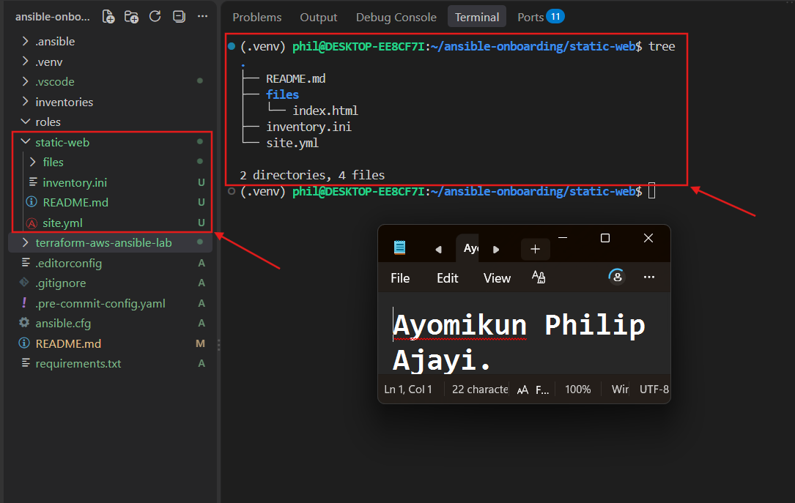

---

# Task 2 — Configure the Ansible Inventory

## Goal

Add both Ubuntu servers to the Ansible inventory.

## Evidence

### Screenshot 2 — Output of `ansible-inventory -i inventory.ini --graph` showing `web1` and `web2`

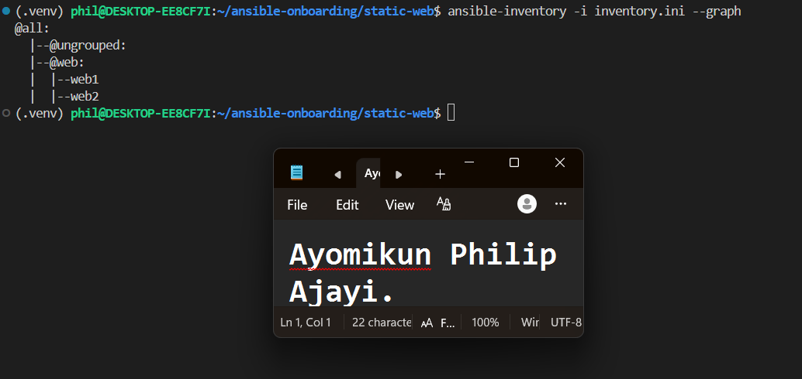

---

## Configuration File

Copy and paste the complete contents of your `inventory.ini` file below:

```ini
[web]
web1 ansible_host=100.53.17.209
web2 ansible_host=52.207.140.252

[web:vars]
ansible_user=ubuntu
ansible_ssh_private_key_file=/home/phil/.ssh/terraform-aws-vm-key
```

---

# Task 3 — Verify Ansible Connectivity

## Goal

Confirm that the Ansible controller can connect to both servers.

## Evidence

### Screenshot 3 — Ansible ping output showing `SUCCESS` and `pong` for both servers

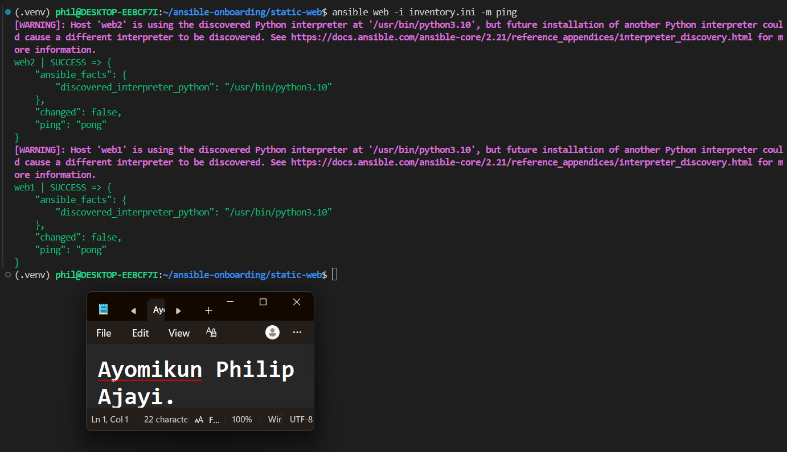

---

# Task 4 — Download and Personalize the Static Website

## Goal

Download `index.html` to the Ansible controller and personalize the website with your full name.

## Evidence

### Screenshot 4 — Edited `files/index.html` showing the footer line with your full name

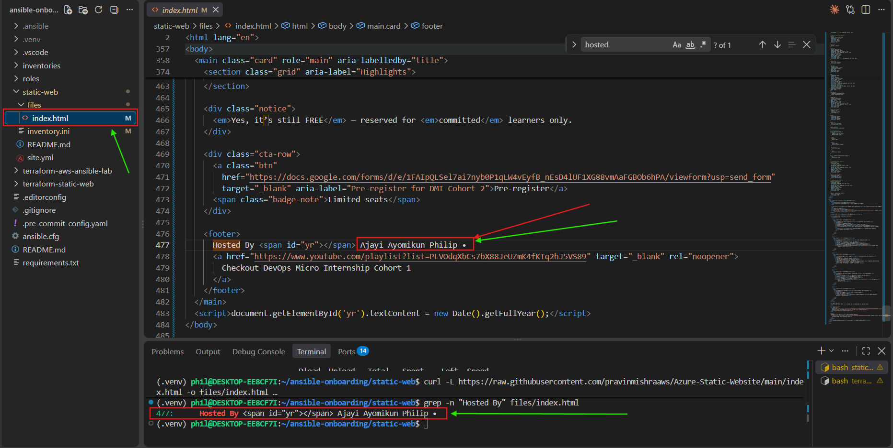

---

# Task 5 — Create the Multi-Play Ansible Playbook

## Goal

Create a single Ansible playbook containing separate plays for installation, deployment, and verification.

## Configuration File

Copy and paste the complete contents of your `site.yml` file below:

```yaml
---
- name: Install and configure Nginx
  hosts: web
  become: true
  tasks:
    - name: Update the APT package cache
      ansible.builtin.apt:
        update_cache: true

    - name: Install Nginx
      ansible.builtin.apt:
        name: nginx
        state: present

    - name: Start and enable Nginx
      ansible.builtin.service:
        name: nginx
        state: started
        enabled: true

- name: Deploy the static website
  hosts: web
  become: true
  tasks:
    - name: Copy index.html to the web root
      ansible.builtin.copy:
        src: files/index.html
        dest: /var/www/html/index.html
        owner: www-data
        group: www-data
        mode: "0644"
      notify: Reload nginx

  handlers:
    - name: Reload nginx
      ansible.builtin.service:
        name: nginx
        state: reloaded

- name: Verify both websites from the controller
  hosts: localhost
  connection: local
  gather_facts: false
  become: false
  tasks:
    - name: Send an HTTP GET request to each web server
      ansible.builtin.uri:
        url: "http://{{ hostvars[item].ansible_host }}"
        status_code: 200
      loop: "{{ groups['web'] }}"
      register: website_checks

    - name: Confirm each server returned HTTP 200
      ansible.builtin.assert:
        that:
          - item.status == 200
        success_msg: "{{ item.item }} returned HTTP {{ item.status }}"
      loop: "{{ website_checks.results }}"
```

---

# Task 6 — Validate the Playbook Syntax

## Goal

Check the playbook for YAML or Ansible syntax errors before running it.

## Evidence

### Screenshot 5 — Successful syntax-check output showing `playbook: site.yml`

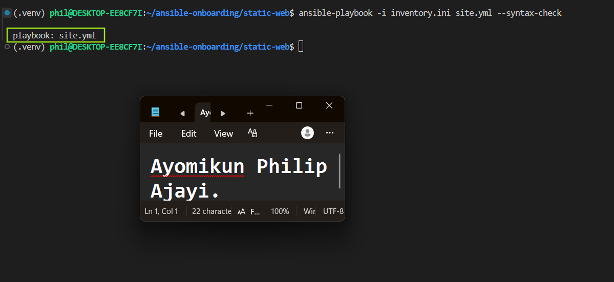

---

# Task 7 — Run the Multi-Play Playbook

## Goal

Install Nginx, deploy the website, and verify both servers in one playbook run.

## Evidence

### Screenshot 6 — Play 3 verification showing HTTP `200` for both servers

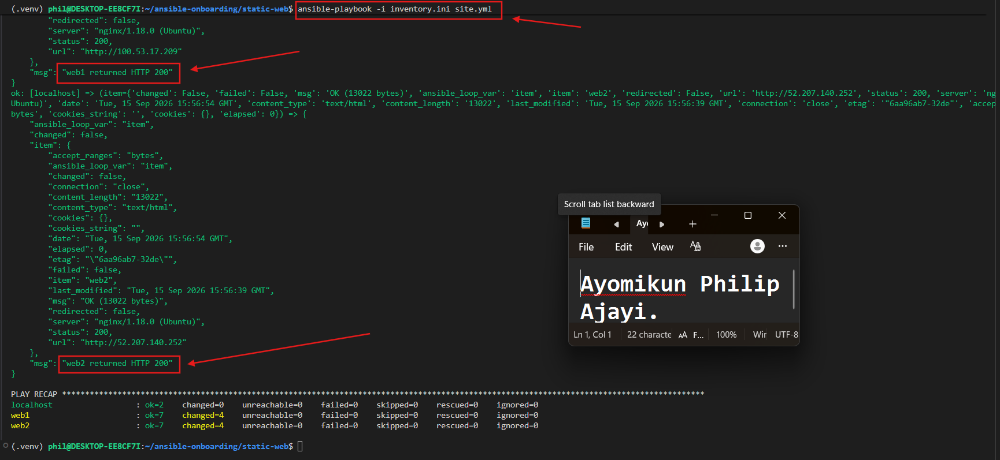

---

### Screenshot 7 — Final play recap showing `unreachable=0` and `failed=0` for `web1`, `web2`, and `localhost`

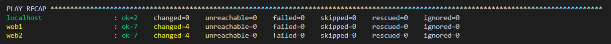

---

# Task 8 — Verify Idempotency

## Goal

Run the playbook again and confirm that it does not make unnecessary changes.

## Evidence

### Screenshot 8 — Second playbook run showing the play recap with `changed=0`, `unreachable=0`, and `failed=0` for both web servers

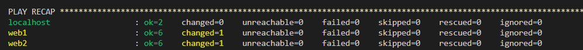

---

# Task 9 — Test Both Websites Manually

## Goal

Confirm that the static website is accessible from both public IP addresses.

## Evidence

### Screenshot 9 — `curl -I` output showing HTTP `200 OK` from both servers

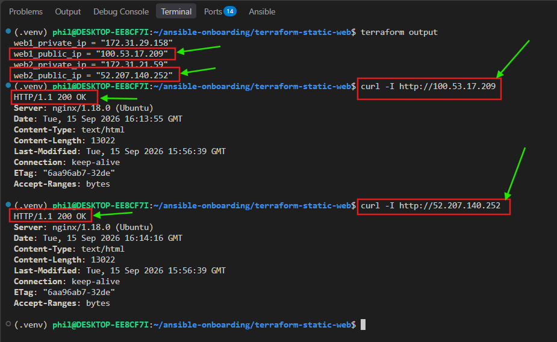

---

### Screenshot 10 — Browser showing the website from Server 1 with the public IP and your full name visible

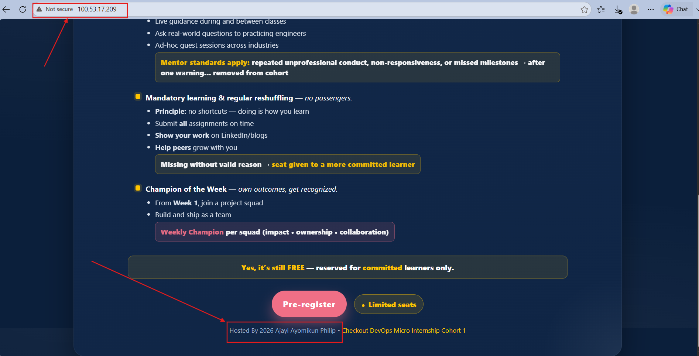

---

### Screenshot 11 — Browser showing the website from Server 2 with the public IP and your full name visible

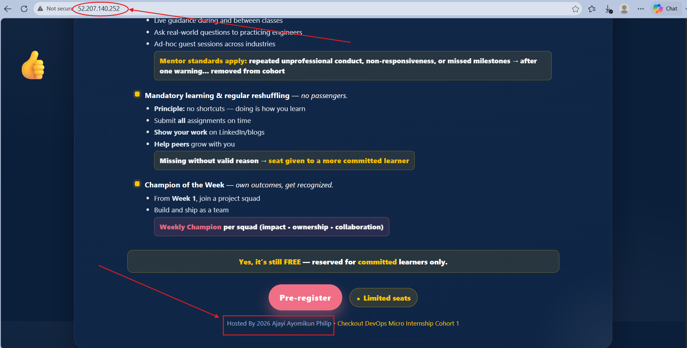

---

## Website URLs

Add both deployed website URLs below:

```text
Server 1: http://100.53.17.209
Server 2: http://52.207.140.252
```

---

# Task 10 — Complete the Project README

## Goal

Document how the project works and record what you learned.

## README Content

Copy and paste the complete contents of your `README.md` file below:

```markdown
# Multi-Play Ansible Static Website Deployment

## Project Overview

For this project I provisioned two Ubuntu web servers on AWS using Terraform, then wrote a single Ansible playbook with three separate plays to install Nginx, deploy a static website to both servers, and verify that both sites were actually reachable. Terraform handled all the infrastructure (the servers, the firewall rules, the SSH key), and Ansible took care of everything after that, installing software and pushing the website files.

## Environment

- Cloud platform: AWS, region us-east-1
- Operating system: Ubuntu 22.04 LTS
- Number of managed servers: 2 (web1 and web2)
- Web server: Nginx

## How to Run the Playbook

Once the servers are up and their public IPs are in inventory.ini, the playbook is run from the static-web folder with:

```bash
ansible-playbook -i inventory.ini site.yml
```

Before running it properly, I checked the syntax with:

```bash
ansible-playbook -i inventory.ini site.yml --syntax-check
```

And confirmed both servers were reachable with:

```bash
ansible web -i inventory.ini -m ping
```

## Issue Faced and Solution

After the servers were created, I ran the Ansible ping module and web2 came back fine, but web1 timed out. I tested SSH directly into both servers using their public IPs from terraform output and both connected without any problem, so I knew the servers themselves were fine. That told me the issue had to be in my inventory.ini file. Looking closer, I had entered web1's private IP instead of its public IP, which only works for traffic inside AWS, not from my own machine. On top of that, the IP I had listed for web2 was actually web1's public IP, so I was pointing at the wrong server entirely. I fixed both entries with the correct public IPs and the ping module worked for both hosts after that.

## What I Learned

This project helped me understand how Terraform and Ansible are meant to work together rather than doing the same job. Terraform is for creating the servers and the surrounding infrastructure, and Ansible takes over once the servers exist, to install and configure things on them. I also got a much clearer idea of the difference between a public and a private IP address, and why using the wrong one causes a timeout instead of some kind of login error. I also ran into a YAML error early on from having a "---" before every play in my playbook, which taught me that a playbook file should only have one "---" at the very top, with each play just added underneath as its own list item.

## Why Installation and Deployment Are Separate

I split installing Nginx and deploying the website into two different plays because they don't really change at the same rate. Installing Nginx and getting it running is something I only need to do once per server, it's not something that changes often. The website content is the opposite, that could get updated fairly often. By keeping them separate, I can redeploy just the website whenever it changes without having to touch the Nginx installation again, which keeps things faster and easier to manage.

## Benefit of the Ansible Copy Module

I used the copy module to push the index.html file to both servers instead of having each server pull the site from a Git repository. The main benefit is consistency, both servers end up with the exact same file at the exact same time, straight from my own machine. There's no chance of one server getting a different version because the repo changed in between clones, and I don't need Git installed on the servers or worry about them having network access or credentials to reach a repository. It's a simpler and more reliable way to get the same content onto multiple servers at once.
```

---

# LinkedIn Post Required

## Evidence

### LinkedIn Post URL

Paste your LinkedIn post URL here:

`https://www.linkedin.com/posts/ayomikunphilip_devops-terraform-ansible-activity-7505680353349775360-n_R4?utm_source=social_share_send&utm_medium=member_desktop_web&rcm=ACoAAF4cLMMBGj_ND3_b5bGU28ywvq8aZAW62fs`

---

### Screenshot — Published LinkedIn post

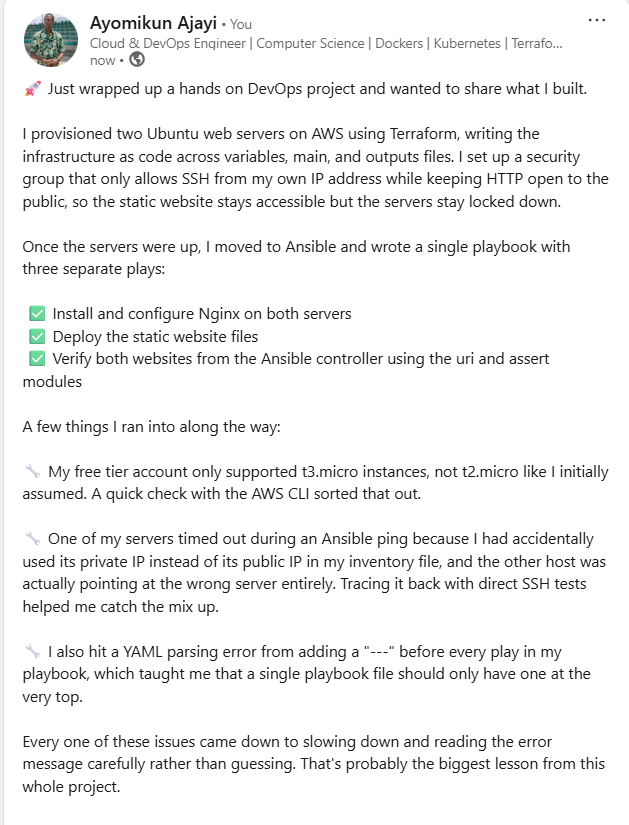

---

# Assignment Questions

Answer the following in your own words:

**1. What issue did you face while completing this assignment, and how did you fix it?**

After I provisioned the two servers with Terraform, I ran the Ansible ping module and web2 came back fine but web1 timed out. I tested SSH directly into both servers using their public IPs and both connected without any issue, so the servers themselves were working. That told me the problem was in my inventory.ini file. It turned out I had entered web1's private IP instead of its public IP, and the private IP only works for traffic inside AWS, not from my own machine. On top of that, the IP I had listed for web2 was actually web1's public IP, so I was pointing at the wrong server entirely. I fixed both entries with the correct public IPs and after that the ping module worked for both hosts.

---

**2. What did you learn from this assignment?**

I learned how Terraform and Ansible are meant to work together instead of doing the same job. Terraform creates the servers and the surrounding infrastructure, and Ansible takes over after that to install and configure things on them. I also got a much clearer understanding of the difference between a public and a private IP address, and why using the wrong one causes a timeout instead of a login error. I ran into a YAML error early on from putting a "---" before every play in my playbook, which taught me that a playbook file should only have one "---" at the top, with each play added underneath as its own list item.

---

**3. Why is it useful to split installation, deployment, and verification into separate plays?**

Splitting them up makes sense because each one does a different job and changes at a different pace. Installing Nginx is something I really only need to do once per server, it's not something that changes often. Deploying the website is something that could happen a lot more frequently as the site gets updated. Verification is a completely separate concern, it's just checking that everything worked, and it runs from my own machine rather than the servers. Keeping them as separate plays means I can rerun just one part, like redeploying the website, without touching the others, and it also makes the playbook easier to read and troubleshoot since each play has one clear purpose.

---

**4. What is one benefit of using the Ansible `copy` module instead of cloning the website directly from Git on every managed server?**

The main benefit is consistency. Using copy means every server gets the exact same file at the exact same time, straight from my own machine. If each server cloned the site from Git on its own, there's a chance one server could end up with a slightly different version if the repository changed in between clones. Using copy also means I don't need Git installed on every server, and I don't have to worry about the servers having network access or credentials to reach the repository. It keeps the deployment simpler and more predictable.

---

**5. What does idempotency mean in this assignment?**

Idempotency means I can run the same playbook over and over and it will only make changes when something actually needs to change, instead of redoing work or causing problems on repeated runs. For example, if Nginx is already installed and running, running the playbook again just confirms that and reports "ok" instead of trying to reinstall it. The same goes for copying the index.html file, if the file on the server already matches the one being copied, Ansible won't report it as changed. This means I can safely rerun site.yml at any time without worrying about breaking anything or duplicating work on the servers.

---

**6. What does the Ansible `uri` module verify in Play 3?**

In Play 3, the uri module sends an HTTP request to each server's public IP address and checks that it gets back a status code of 200, which means the website responded successfully. It's essentially the same check as running curl against each server, but built into the playbook so it happens automatically. If either server didn't have Nginx running properly or the website file wasn't in place, the request wouldn't return 200, and that task would fail, which is what tells me the deployment actually worked from an outside perspective rather than just trusting that the earlier tasks reported success.
---

# Required Files

Confirm that the following files are included in your assignment folder:

- [ ] `inventory.ini`
- [ ] `site.yml`
- [ ] `files/index.html`
- [ ] `README.md`

---

# Submission Instructions

- Add all required screenshots in the correct order.
- Full Name must be visible in required screenshots.
- Include both deployed website URLs.
- Paste `inventory.ini`, `site.yml`, and `README.md` as editable text.
- Answer all assignment questions clearly in your own words.
- Add your LinkedIn post URL.
- Do not expose SSH private keys, passwords, cloud account IDs, or other sensitive information.

---

# Completion Checklist

- [ ] Task 1: `static-web` folder structure is complete
- [ ] Task 2: Both servers are listed under the `[web]` group in `inventory.ini`
- [ ] Task 2: Inventory graph shows `web1` and `web2`
- [ ] Task 3: Ansible ping returns `SUCCESS` and `pong` for both servers
- [ ] Task 4: `files/index.html` contains your full name
- [ ] Task 5: `site.yml` contains three separate plays
- [ ] Task 5: Play 1 installs, starts, and enables Nginx
- [ ] Task 5: Play 2 deploys `index.html` using the `copy` module
- [ ] Task 5: Nginx reload handler is included
- [ ] Task 5: Play 3 verifies both web servers from the controller
- [ ] Task 6: Playbook syntax check passes
- [ ] Task 7: First playbook run completes with `unreachable=0` and `failed=0`
- [ ] Task 7: URI verification returns HTTP `200` for both servers
- [ ] Task 8: Second playbook run demonstrates idempotency
- [ ] Task 8: Second run shows `changed=0` for both web servers
- [ ] Task 9: Both `curl -I` commands return HTTP `200 OK`
- [ ] Task 9: Website loads from Server 1
- [ ] Task 9: Website loads from Server 2
- [ ] Task 9: Full name is visible on both deployed websites
- [ ] Task 10: `README.md` contains all required explanations
- [ ] Screenshots 1–11 are included
- [ ] `inventory.ini`, `site.yml`, and `README.md` are pasted as editable text
- [ ] Both website URLs are included
- [ ] Assignment questions are answered
- [ ] LinkedIn post published
- [ ] LinkedIn post URL added
- [ ] No sensitive information is exposed

---

## About DMI & CloudAdvisory

DevOps Micro Internship (DMI) is a project-based DevOps program run by Pravin Mishra and The CloudAdvisory, focused on real-world execution, systems thinking, and career readiness.

It helps learners build strong DevOps foundations with hands-on experience.

---

## Resources

- DMI Official Website: [https://dmi.pravinmishra.com?utm_source=github&utm_medium=readme](https://dmi.pravinmishra.com?utm_source=github&utm_medium=readme)
- University: [https://university.pravinmishra.com?utm_source=github&utm_medium=readme](https://university.pravinmishra.com?utm_source=github&utm_medium=readme)
- Discord Community: [https://discord.pravinmishra.com?utm_source=github&utm_medium=readme](https://discord.pravinmishra.com?utm_source=github&utm_medium=readme)
- Blog: [https://dmi.pravinmishra.com/blog?utm_source=github&utm_medium=readme](https://dmi.pravinmishra.com/blog?utm_source=github&utm_medium=readme)
- YouTube Playlist: [https://www.youtube.com/playlist?list=PLFeSNDtI4Cho](https://www.youtube.com/playlist?list=PLFeSNDtI4Cho)
- Pravin Mishra LinkedIn: [https://www.linkedin.com/in/pravin-mishra-aws-trainer/](https://www.linkedin.com/in/pravin-mishra-aws-trainer/)
- CloudAdvisory LinkedIn: [https://www.linkedin.com/company/thecloudadvisory/](https://www.linkedin.com/company/thecloudadvisory/)

---

*This submission is part of DevOps Micro Internship (DMI) — Agentic AI Track.*