# Assignment 04 — Deploy Mini Finance on Azure Using Terraform and Ansible

Part of the DevOps Micro Internship (DMI) with Agentic AI

---

## Purpose

In this assignment, you will provision Azure infrastructure using Terraform and deploy the Mini Finance website using an Ansible multi-play playbook.

Terraform will create the Azure Virtual Machine and networking resources. Ansible will install Nginx, clone the Mini Finance repository, deploy the website, and verify the deployment.

---

# Task 1 — Create the Project Structure

## Goal

Create separate directories and files for the Terraform infrastructure and Ansible configuration.

### Evidence

#### Screenshot 1 — Terminal or VS Code showing the complete `mini-finance` project structure

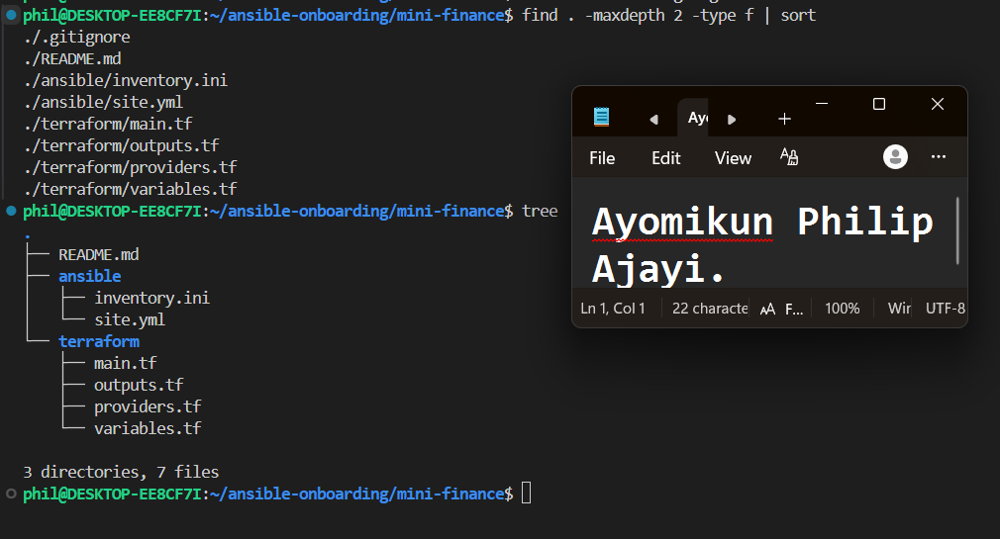

---

### Notes

Setting up the folders first made everything after this much easier to follow. Splitting Terraform into its own folder and Ansible into its own folder meant I never had to guess where a file belonged.

---

# Task 2 — Create the Azure Infrastructure Using Terraform

## Goal

Use Terraform to provision an Ubuntu Virtual Machine with the required Azure networking and security resources.

### Evidence

#### Screenshot 2 — Terraform code showing the `Allow-SSH` rule for port `22` and the `Allow-HTTP` rule for port `80`

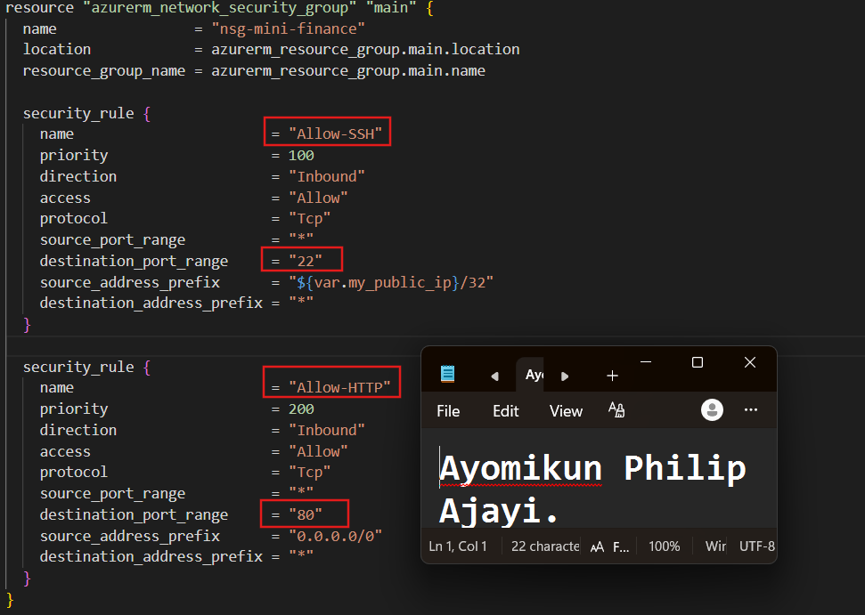

---

#### Screenshot 3 — Terraform code showing the association between `nsg-mini-finance` and `nic-mini-finance`

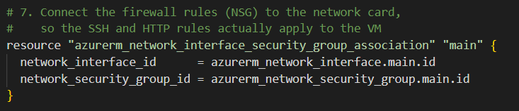

---

### Notes

I originally planned to use Standard_DC1s_v3 for the VM size, since that was requested early on. It turned out this size is meant for confidential computing and needs a Gen2 image, while the Ubuntu image I was using is Gen1. Azure rejected the VM creation with a Hypervisor Generation error. I switched to a size that actually matched a free tier friendly and Gen1 compatible option instead.

---

# Task 3 — Initialize and Apply the Terraform Configuration

## Goal

Format and validate the Terraform configuration, review the execution plan, and provision the Azure infrastructure.

### Evidence

#### Screenshot 4 — End of the `terraform apply` output showing `Apply complete!` with no errors

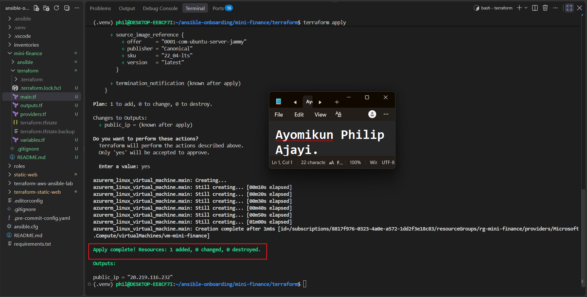

---

#### Screenshot 5 — Output of `terraform output public_ip` showing the VM’s public IP address

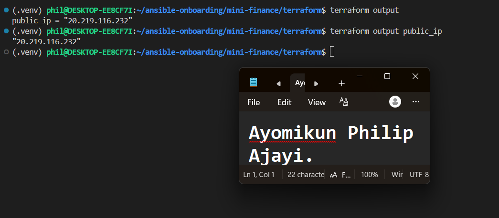

---

### Notes

The first terraform apply failed with an error saying the resource group already existed. This happened because an earlier deployment (in a different region) had already created resources under the same name. I checked what was inside that resource group with az resource list, confirmed it was safe to remove, deleted it, waited for the deletion to finish, then ran apply again. After that it went through cleanly and gave me the public IP in the output.

---

# Task 4 — Verify Passwordless SSH Access

## Goal

Confirm that the Ansible controller can connect to the Terraform-provisioned Azure VM using SSH key authentication.

### Evidence

#### Screenshot 6 — Passwordless SSH command and the returned `mini-finance` hostname

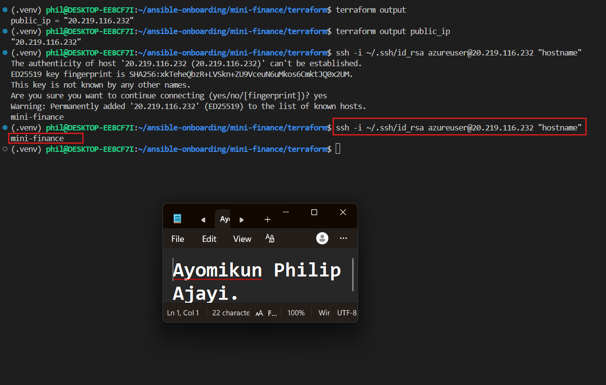

---

### Notes

I hit a real snag here around SSH key types. The assignment called for Ed25519, but Azure's Terraform provider only validates RSA formatted keys in the admin_ssh_key field, so Terraform rejected the Ed25519 key outright. Since Ed25519 was not a hard grading requirement for me, I generated a fresh standalone RSA key with ssh-keygen, set it as the login key, and confirmed the file permissions were correct (600 for the private key, 644 for the public key) before testing the SSH connection.

---

# Task 5 — Create the Ansible Inventory and Verify Connectivity

## Goal

Add the Terraform-provisioned Azure VM to the Ansible inventory and confirm that Ansible can connect to it.

### Evidence

#### Screenshot 7 — Ansible ping output showing `SUCCESS` and `pong` from the Azure VM

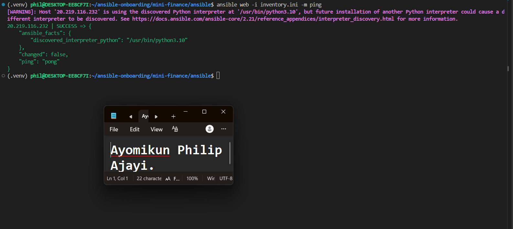

---

### Configuration File

Copy and paste the complete contents of your `ansible/inventory.ini` file below:

```ini
[web]
20.219.116.232

[web:vars]
ansible_user=azureuser
ansible_ssh_private_key_file=~/.ssh/id_rsa
```

---

# Task 6 — Create the Multi-Play Ansible Playbook

## Goal

Create one Ansible playbook containing separate plays to install Nginx, deploy the Mini Finance website, and verify the deployment.

### Evidence

#### Screenshot 8 — `site.yml` showing Play 1 and the beginning of Play 2

Screenshot must show:

- Play 1 targeting the `web` group
- Installation of `nginx`, `git`, and `rsync`
- Nginx service configured as started and enabled
- Beginning of Play 2 with the Git repository URL and synchronization task

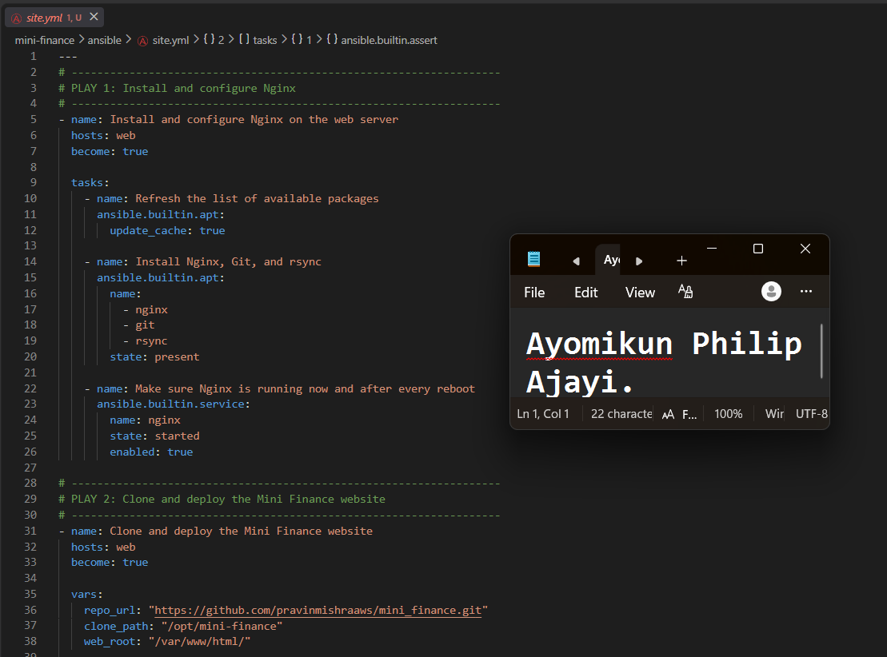

---

#### Screenshot 9 — `site.yml` showing the deployment destination, handler, and Play 3 verification

Screenshot must show:

- Website destination `/var/www/html/`
- Ownership set to `www-data:www-data`
- Nginx reload handler
- Play 3 targeting `localhost`
- The `uri` verification and `assert` condition

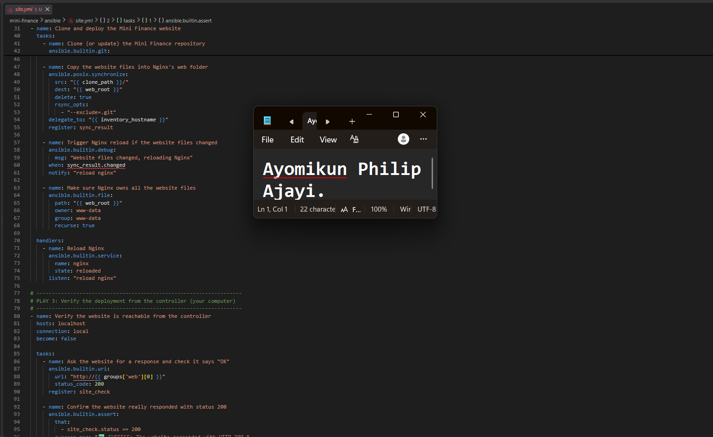

---

### Configuration File

Copy and paste the complete contents of your `ansible/site.yml` file below:

```yaml
---
# -------------------------------------------------------------------
# PLAY 1: Install and configure Nginx
# -------------------------------------------------------------------
- name: Install and configure Nginx on the web server
  hosts: web
  become: true

  tasks:
    - name: Refresh the list of available packages
      ansible.builtin.apt:
        update_cache: true

    - name: Install Nginx, Git, and rsync
      ansible.builtin.apt:
        name:
          - nginx
          - git
          - rsync
        state: present

    - name: Make sure Nginx is running now and after every reboot
      ansible.builtin.service:
        name: nginx
        state: started
        enabled: true

# -------------------------------------------------------------------
# PLAY 2: Clone and deploy the Mini Finance website
# -------------------------------------------------------------------
- name: Clone and deploy the Mini Finance website
  hosts: web
  become: true

  vars:
    repo_url: "https://github.com/pravinmishraaws/mini_finance.git"
    clone_path: "/opt/mini-finance"
    web_root: "/var/www/html/"

  tasks:
    - name: Clone (or update) the Mini Finance repository
      ansible.builtin.git:
        repo: "{{ repo_url }}"
        dest: "{{ clone_path }}"
        version: main

    - name: Copy the website files into Nginx's web folder
      ansible.posix.synchronize:
        src: "{{ clone_path }}/"
        dest: "{{ web_root }}"
        delete: true
        rsync_opts:
          - "--exclude=.git"
      delegate_to: "{{ inventory_hostname }}"
      register: sync_result

    - name: Trigger Nginx reload if the website files changed
      ansible.builtin.debug:
        msg: "Website files changed, reloading Nginx"
      when: sync_result.changed
      notify: "reload nginx"

    - name: Make sure Nginx owns all the website files
      ansible.builtin.file:
        path: "{{ web_root }}"
        owner: www-data
        group: www-data
        recurse: true

  handlers:
    - name: Reload Nginx
      ansible.builtin.service:
        name: nginx
        state: reloaded
      listen: "reload nginx"

# -------------------------------------------------------------------
# PLAY 3: Verify the deployment from the controller (your computer)
# -------------------------------------------------------------------
- name: Verify the website is reachable from the controller
  hosts: localhost
  connection: local
  become: false

  tasks:
    - name: Ask the website for a response and check it says "OK"
      ansible.builtin.uri:
        url: "http://{{ groups['web'][0] }}"
        status_code: 200
      register: site_check

    - name: Confirm the website really responded with status 200
      ansible.builtin.assert:
        that:
          - site_check.status == 200
        success_msg: "✅ SUCCESS: The website responded with HTTP 200."
        fail_msg: "❌ FAILED: The website did not respond with HTTP 200."
```

---

# Task 7 — Validate and Run the Ansible Playbook

## Goal

Validate the syntax of the multi-play Ansible playbook and run it to install Nginx, deploy the Mini Finance website, and verify the deployment.

### Evidence

#### Screenshot 10 — Successful playbook syntax check showing `playbook: site.yml`

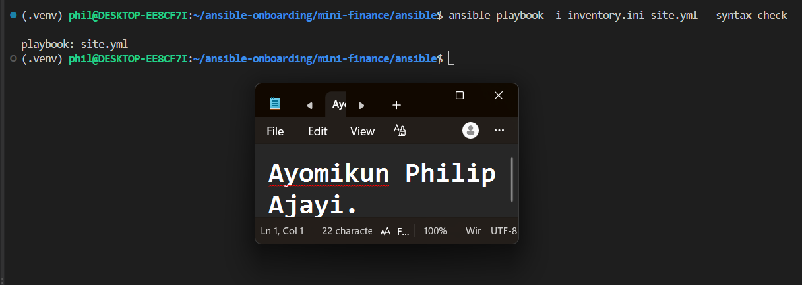

---

#### Screenshot 11 — Play 3 output showing the successful HTTP verification and assertion

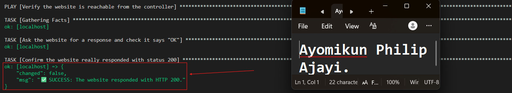

---

#### Screenshot 12 — Final `PLAY RECAP` showing `failed=0` and `unreachable=0`

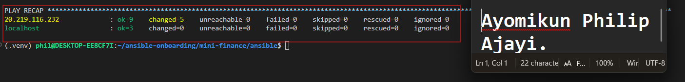

---

### Notes

The syntax check passed on the first real attempt, but the actual run would have failed because delegate_to and register were indented one level too far, placing them inside the synchronize module instead of at the task level. YAML did not flag this as invalid syntax since it was still valid YAML, it just meant the wrong thing. Fixing the indentation so both lines sat level with ansible.posix.synchronize resolved it.

---

# Task 8 — Test the Mini Finance Website in a Browser

## Goal

Confirm that the Mini Finance website is publicly accessible through the Azure VM’s public IP address.

### Evidence

#### Screenshot 13 — Mini Finance website successfully loading in the browser, with the Azure VM’s public IP address visible in the address bar

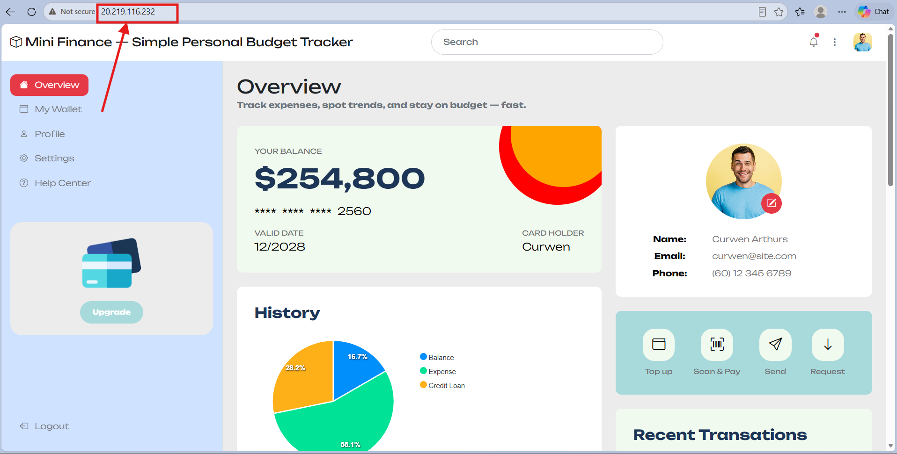

---

### Website URL

Add your deployed website URL below:

```text
http://20.219.116.232
```

---

# Task 9 — Create the Project README

## Goal

Create a `README.md` file to document the Mini Finance infrastructure and deployment project.

### Evidence

#### Screenshot 14 — Completed `README.md` displayed in the VS Code Markdown preview or terminal

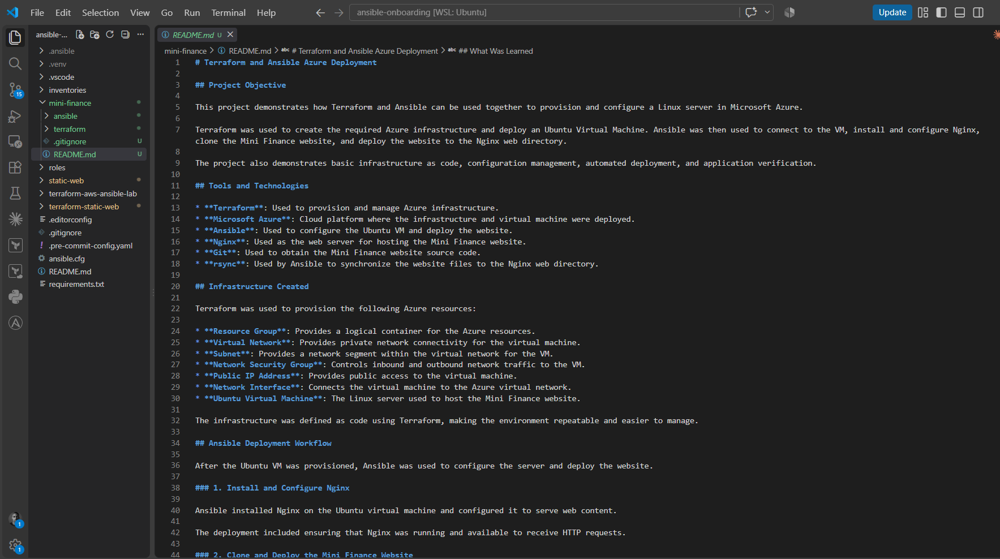

---

### README Content

Copy and paste the complete contents of your `README.md` file below:

```markdown
# Terraform and Ansible Azure Deployment

## Project Objective

This project demonstrates how Terraform and Ansible can be used together to provision and configure a Linux server in Microsoft Azure.

Terraform was used to create the required Azure infrastructure and deploy an Ubuntu Virtual Machine. Ansible was then used to connect to the VM, install and configure Nginx, clone the Mini Finance website, and deploy the website to the Nginx web directory.

The project also demonstrates basic infrastructure as code, configuration management, automated deployment, and application verification.

## Tools and Technologies

* **Terraform**: Used to provision and manage Azure infrastructure.
* **Microsoft Azure**: Cloud platform where the infrastructure and virtual machine were deployed.
* **Ansible**: Used to configure the Ubuntu VM and deploy the website.
* **Nginx**: Used as the web server for hosting the Mini Finance website.
* **Git**: Used to obtain the Mini Finance website source code.
* **rsync**: Used by Ansible to synchronize the website files to the Nginx web directory.

## Infrastructure Created

Terraform was used to provision the following Azure resources:

* **Resource Group**: Provides a logical container for the Azure resources.
* **Virtual Network**: Provides private network connectivity for the virtual machine.
* **Subnet**: Provides a network segment within the virtual network for the VM.
* **Network Security Group**: Controls inbound and outbound network traffic to the VM.
* **Public IP Address**: Provides public access to the virtual machine.
* **Network Interface**: Connects the virtual machine to the Azure virtual network.
* **Ubuntu Virtual Machine**: The Linux server used to host the Mini Finance website.

The infrastructure was defined as code using Terraform, making the environment repeatable and easier to manage.

## Ansible Deployment Workflow

After the Ubuntu VM was provisioned, Ansible was used to configure the server and deploy the website.

### 1. Install and Configure Nginx

Ansible installed Nginx on the Ubuntu virtual machine and configured it to serve web content.

The deployment included ensuring that Nginx was running and available to receive HTTP requests.

### 2. Clone and Deploy the Mini Finance Website

The Mini Finance website source code was obtained using Git.

Ansible then used `rsync` through the `ansible.posix.synchronize` module to copy the website files into Nginx's web root directory. The `.git` directory was excluded from the deployed files.

A handler was also configured to reload Nginx when the website files were changed.

### 3. Verify the Website

After deployment, the web server was tested to confirm that the website was accessible.

The HTTP response was checked to ensure that the application returned:

```text
HTTP 200 OK
```

A status code of `200` confirmed that the web server was responding successfully.

## Verification

The deployment was verified at two levels.

First, Ansible was used to confirm that the server configuration and deployment tasks completed successfully. The Nginx service was also checked to ensure that it was active.

The website was then accessed through a web browser using the public IP address assigned to the Azure VM.

The Mini Finance website loaded successfully in the browser, confirming that:

1. The Azure VM was reachable.
2. Network access was correctly configured.
3. Nginx was running.
4. The website files were deployed correctly.
5. The web server returned HTTP status code `200`.

## Challenge and Solution

One issue encountered during the project involved the Ansible `synchronize` task.

The `delegate_to` and `register` keywords were initially placed at the wrong indentation level, making them appear as parameters of the `ansible.posix.synchronize` module instead of task-level keywords.

The issue was resolved by correcting the YAML indentation so that `delegate_to` and `register` were aligned with the `ansible.posix.synchronize` module declaration.

The corrected structure was:

```yaml
- name: Copy the website files into Nginx's web folder
  ansible.posix.synchronize:
    src: "{{ clone_path }}/"
    dest: "{{ web_root }}"
    delete: true
    rsync_opts:
      - "--exclude=.git"
  delegate_to: "{{ inventory_hostname }}"
  register: sync_result
  notify: "reload nginx"
```

This highlighted the importance of correct YAML indentation when working with Ansible playbooks.

## What Was Learned

This project provided practical experience with using Terraform and Ansible together.

Terraform was used to handle **infrastructure provisioning**, while Ansible handled **server configuration and application deployment**.

I learned how to provision Azure resources as code, connect Ansible to a newly created Linux VM, install and configure Nginx, deploy application files, use handlers for configuration changes, and verify a deployment from both the command line and a web browser.

The project also reinforced the importance of troubleshooting carefully, especially when working with SSH keys, YAML indentation, networking, and automated deployment workflows.

```

---

# LinkedIn Post Required

## Evidence

#### Screenshot 15 — Published LinkedIn post showing the text and at least one deployment screenshot

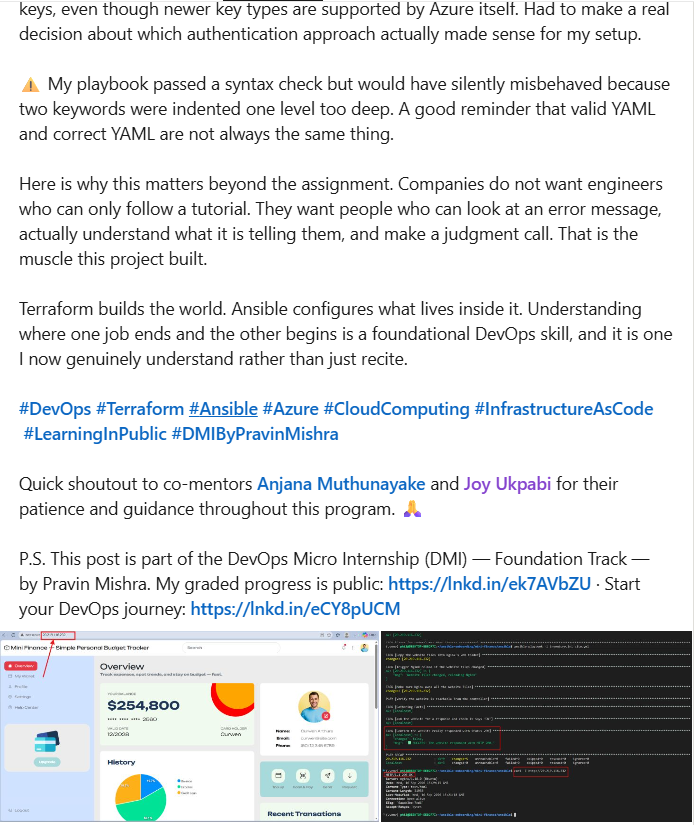

---

#### LinkedIn Post URL

Paste your LinkedIn post URL here:

`https://www.linkedin.com/posts/ayomikunphilip_devops-terraform-ansible-ugcPost-7506229644602302466-IEbq/?utm_source=social_share_send&utm_medium=member_desktop_web&rcm=ACoAAF4cLMMBGj_ND3_b5bGU28ywvq8aZAW62fs`

---

### LinkedIn Submission Notes

**One challenge you faced and how you fixed it:**

The trickiest challenge was the SSH key mismatch. Azure's Terraform provider only validates RSA formatted keys in the admin_ssh_key field, but I initially planned to use an Ed25519 key. Terraform kept rejecting it outright. Once I confirmed the key type was not a hard grading requirement, I generated a fresh standalone RSA key with ssh-keygen, double checked the file permissions were correct, and pointed my Terraform config at that instead. It taught me that sometimes the right fix is not forcing your original plan to work, but stepping back and choosing the simpler path that actually fits the tools you are using.

---

**One real-world example where you can use this learning:**

This exact workflow mirrors how small startups and lean engineering teams actually stand up new environments. Instead of manually clicking through a cloud console every time a new server is needed, you write the infrastructure once in Terraform and the configuration once in Ansible, then reuse both for staging environments, new client deployments, or disaster recovery. If a server ever goes down or gets corrupted, you are not scrambling to remember what you clicked six months ago. You just run the same code again and get an identical environment back in minutes.

---

# Assignment Questions

Answer the following in your own words:

**1. What did you provision using Terraform in this assignment?**

I used Terraform to create the full Azure networking and compute setup: a resource group, a virtual network with a subnet, a network security group with rules for SSH and HTTP, a public IP, a network interface, and the Ubuntu virtual machine itself.

---

**2. What did Ansible configure and deploy in this assignment?**

Ansible installed Nginx, Git, and rsync on the VM, cloned the Mini Finance website repository, copied the site files into Nginx's web folder, set the correct file ownership, and then checked from my own machine that the site was actually reachable over HTTP.

---

**3. Why is SSH access on port `22` restricted to your public IP address?**

Restricting it means only my own computer can attempt to log in over SSH. Leaving port 22 open to the whole internet is one of the most common ways servers get scanned and attacked, since bots constantly probe for open SSH ports.

---

**4. Why is HTTP port `80` open to the internet?**

The whole point of the website is for anyone to be able to visit it in a browser. Port 80 has to be open publicly for that to work, unlike SSH, which is only meant for the person managing the server.

---

**5. What is the purpose of the Ansible inventory file?**

It tells Ansible which servers to manage, what username to log in as, and which SSH key to use. Without it, Ansible would have no way of knowing where to send its instructions.

---

**6. Why does the playbook use separate plays for install, deploy, and verify?**

Splitting things into separate plays keeps each stage focused on one job. It also means if something fails, it is much easier to tell exactly which stage broke, rather than digging through one long block of tasks trying to figure out what happened.

---

**7. Why is `rsync` useful when deploying website files?**

Rsync only copies files that have actually changed instead of copying everything every time, which makes deployments faster. It also has an option to delete files on the destination that no longer exist in the source, which keeps the web server in sync with the actual repository content.

---

**8. What does the Ansible `uri` module verify in this assignment?**

It sends an actual HTTP request to the server's public IP address and checks that it returns a 200 status code, which means the website responded successfully. This confirms the deployment worked, not just that the playbook ran without errors.

---

**9. What issue did you face during this assignment, and how did you fix it?**

The biggest one was the SSH key mismatch between what Azure's Terraform provider accepts and what the assignment initially called for. I worked through it by generating a standalone RSA key once Ed25519 was confirmed not to be a strict requirement, which simplified the setup considerably. I also ran into a YAML indentation mistake in the playbook that would have caused a silent failure, since --syntax-check does not catch keywords nested at the wrong level.

---

**10. What did you learn from using Terraform and Ansible together?**

Terraform and Ansible solve two different problems that work well together. Terraform is for building the infrastructure itself, the VM, the network, the firewall rules, while Ansible is for configuring what runs on top of that infrastructure once it exists. Keeping those responsibilities separate made the whole project easier to reason about and troubleshoot.

---

# Required Files

Confirm that the following files are included in your assignment folder:

- [ ] `.gitignore`
- [ ] `README.md`
- [ ] `terraform/providers.tf`
- [ ] `terraform/main.tf`
- [ ] `terraform/variables.tf`
- [ ] `terraform/outputs.tf`
- [ ] `ansible/inventory.ini`
- [ ] `ansible/site.yml`

---

# Submission Instructions

- Add all required screenshots in the correct order.
- Full Name must be visible in required screenshots.
- Add the Azure VM public IP address.
- Add the final Mini Finance website URL.
- Paste `inventory.ini`, `site.yml`, and `README.md` as editable text.
- Answer all assignment questions clearly in your own words.
- Add your LinkedIn post URL.
- Do not expose SSH private keys, passwords, Azure credentials, subscription IDs, Terraform state contents, or other sensitive information.

---

# Completion Checklist

- [ ] Task 1: `mini-finance` project structure created
- [ ] Task 1: `.gitignore` created
- [ ] Task 2: Terraform Azure infrastructure code created
- [ ] Task 2: `Allow-SSH` rule configured for port `22`
- [ ] Task 2: `Allow-HTTP` rule configured for port `80`
- [ ] Task 2: NSG associated with the Network Interface
- [ ] Task 3: `terraform fmt` completed
- [ ] Task 3: `terraform init` completed
- [ ] Task 3: `terraform validate` completed successfully
- [ ] Task 3: `terraform apply` completed successfully
- [ ] Task 3: `terraform output public_ip` displayed the VM public IP
- [ ] Task 4: Passwordless SSH works from the Ansible controller
- [ ] Task 5: `inventory.ini` created
- [ ] Task 5: Ansible ping returns `SUCCESS` and `pong`
- [ ] Task 6: `site.yml` contains three separate plays
- [ ] Task 6: Play 1 installs Nginx, Git, and rsync
- [ ] Task 6: Play 2 clones and deploys the Mini Finance website
- [ ] Task 6: Play 3 verifies HTTP status code `200`
- [ ] Task 7: Playbook syntax check passes
- [ ] Task 7: Ansible playbook completes successfully
- [ ] Task 7: Final recap shows `failed=0` and `unreachable=0`
- [ ] Task 8: Mini Finance website loads in the browser
- [ ] Task 8: Azure VM public IP is visible in the browser screenshot
- [ ] Task 9: `README.md` completed
- [ ] Screenshots 1–15 are included
- [ ] `inventory.ini`, `site.yml`, and `README.md` are pasted as editable text
- [ ] Assignment questions are answered
- [ ] LinkedIn post published with Anyone visibility
- [ ] LinkedIn post URL added
- [ ] No sensitive information is exposed

---

## About DMI & CloudAdvisory

DevOps Micro Internship (DMI) is a project-based DevOps program run by Pravin Mishra and The CloudAdvisory, focused on real-world execution, systems thinking, and career readiness.

It helps learners build strong DevOps foundations with hands-on experience.

---

## Resources

- DMI Official Website: [https://dmi.pravinmishra.com?utm_source=github&utm_medium=readme](https://dmi.pravinmishra.com?utm_source=github&utm_medium=readme)
- University: [https://university.pravinmishra.com?utm_source=github&utm_medium=readme](https://university.pravinmishra.com?utm_source=github&utm_medium=readme)
- Discord Community: [https://discord.pravinmishra.com?utm_source=github&utm_medium=readme](https://discord.pravinmishra.com?utm_source=github&utm_medium=readme)
- Blog: [https://dmi.pravinmishra.com/blog?utm_source=github&utm_medium=readme](https://dmi.pravinmishra.com/blog?utm_source=github&utm_medium=readme)
- YouTube Playlist: [https://www.youtube.com/playlist?list=PLFeSNDtI4Cho](https://www.youtube.com/playlist?list=PLFeSNDtI4Cho)
- Pravin Mishra LinkedIn: [https://www.linkedin.com/in/pravin-mishra-aws-trainer/](https://www.linkedin.com/in/pravin-mishra-aws-trainer/)
- CloudAdvisory LinkedIn: [https://www.linkedin.com/company/thecloudadvisory/](https://www.linkedin.com/company/thecloudadvisory/)

---

*This submission is part of DevOps Micro Internship (DMI) — Agentic AI Track.*