# Assignment — Deploy EpicBook with Terraform and Ansible Roles

Part of the DevOps Micro Internship (DMI) with Agentic AI

---

## Purpose

In this assignment, you will deploy the EpicBook web application using Terraform and Ansible roles.

Terraform provisions the cloud infrastructure, including one Ubuntu VM and one managed MySQL database. Ansible roles configure the VM, install required software, deploy the EpicBook application, configure Nginx, connect the app to the managed MySQL database, and verify the deployment.

---

# Task 1 — Set Up the Project Folder Layout

## Goal

Create the project folder structure for Terraform and Ansible roles.

Terraform will be used to provision the cloud infrastructure. Ansible roles will be used to configure the VM and deploy the EpicBook application.

### Evidence

#### Screenshot 1 — Terminal showing the completed `epicbook-prod` project structure

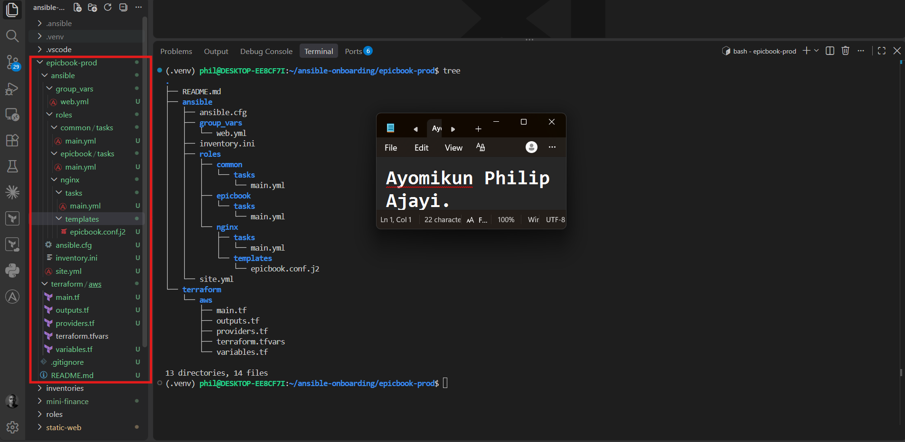

---

### Notes

Answer the following in your own words:

**1. Which cloud provider did you choose for this assignment?**

AWS

---

**2. Why is it useful to keep Terraform files and Ansible files in separate folders?**

It keeps things tidy. Terraform builds the infrastructure and Ansible sets it up, so I can change one without breaking the other.

---

**3. What is the purpose of the `roles` directory in Ansible?**

The roles folder holds the separate parts of the setup, like common, nginx and epicbook. Each role does one job and can be reused.

---

# Task 2 — Provision the Infrastructure with Terraform

## Goal

Run Terraform to provision the cloud infrastructure for the EpicBook deployment.

Terraform will create the VM, managed MySQL database, networking, security rules, and required outputs.

### Evidence

#### Screenshot 2 — `terraform apply` completed successfully

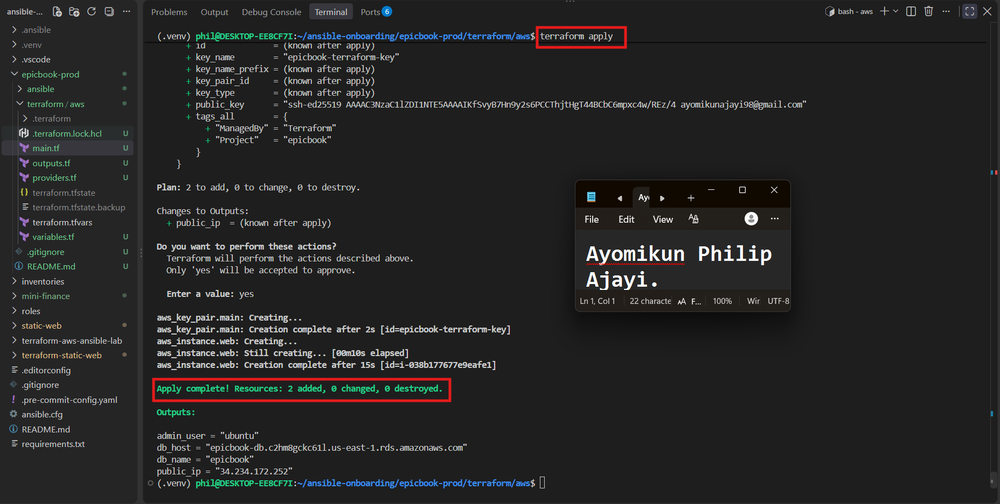

---

#### Screenshot 3 — Output of `terraform output`

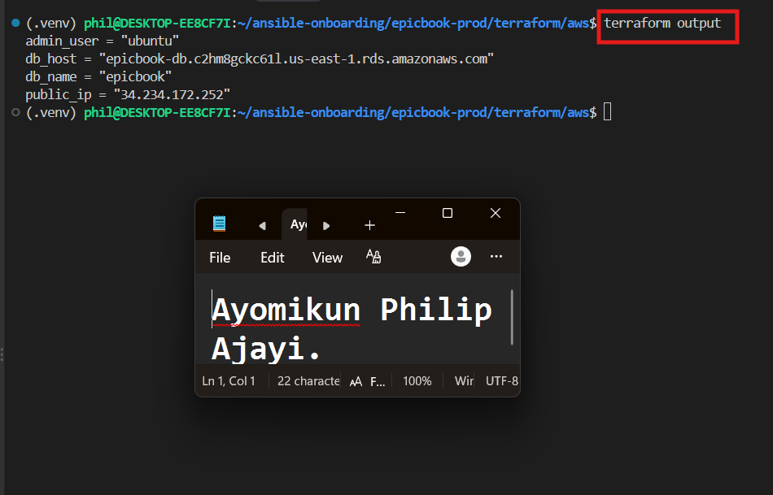

---

#### Screenshot 4 — Azure Portal or AWS Console showing the VM running

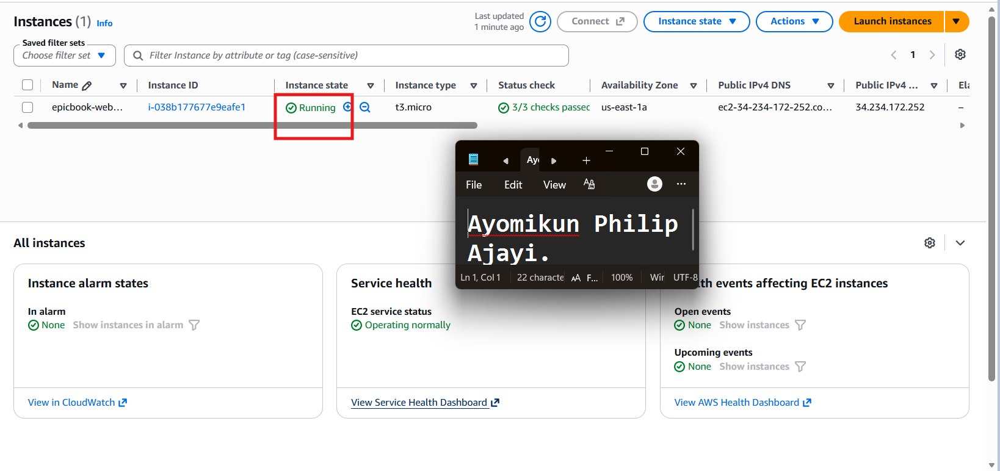

---

#### Screenshot 5 — Azure Portal or AWS Console showing the managed MySQL database created

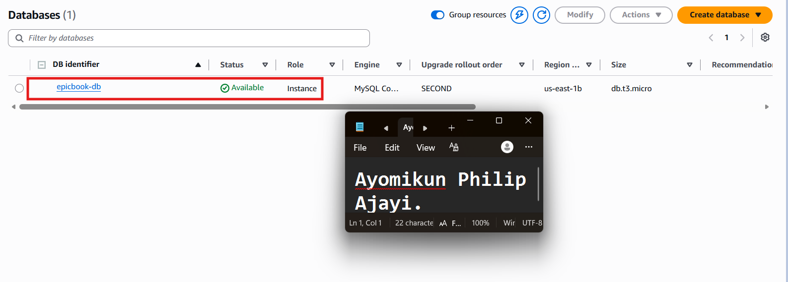

---

### Notes

Answer the following in your own words:

**1. What resources did Terraform create for this assignment?**

Terraform created a VPC, an internet gateway, one public subnet, two private subnets, a route table, two security groups, a key pair, one Ubuntu t3.micro VM, a DB subnet group and a managed MySQL database on RDS.

---

**2. Why should you review `terraform plan` before running `terraform apply`?**

The plan shows what will be created, changed or deleted before anything happens. It helps me catch mistakes or wrong settings early.

---

**3. Why should database passwords not be shown in Terraform output?**

Anyone who sees the terminal, logs or a screenshot could read it and get into the database. Secrets should stay hidden.

---

# Task 3 — Verify SSH Key-Based Access

## Goal

Verify that the cloud VM can be accessed from the Ansible controller using SSH key-based authentication.

### Evidence

#### Screenshot 6 — Successful SSH hostname check from the Ansible controller

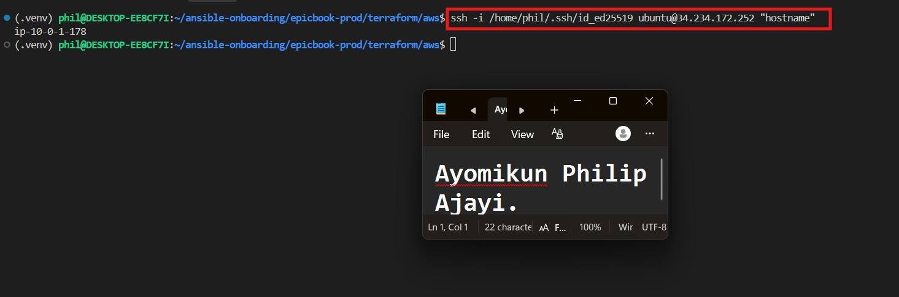

---

### Notes

Answer the following in your own words:

**1. What command did you use to verify SSH access?**

I ran ssh -i ~/.ssh/id_ed25519 ubuntu@34.234.172.252 hostname.

---

**2. What proves that SSH key-based access worked successfully?**

I logged in without typing a password and the server sent back its hostname.

---

**3. What would you check if SSH returned `Permission denied (publickey)`?**

I would check that I'm using the right private key, that the key file permissions are 600, that the user is ubuntu, that the key uploaded to AWS matches my private key, and that the security group still allows my current IP on port 22.

---

# Task 4 — Create the Ansible Inventory and Configuration

## Goal

Create the Ansible inventory file and local Ansible configuration for the EpicBook VM.

The inventory tells Ansible which VM to manage and which SSH user to use.

### Evidence

#### Screenshot 7 — `inventory.ini` showing the VM under the `web` group

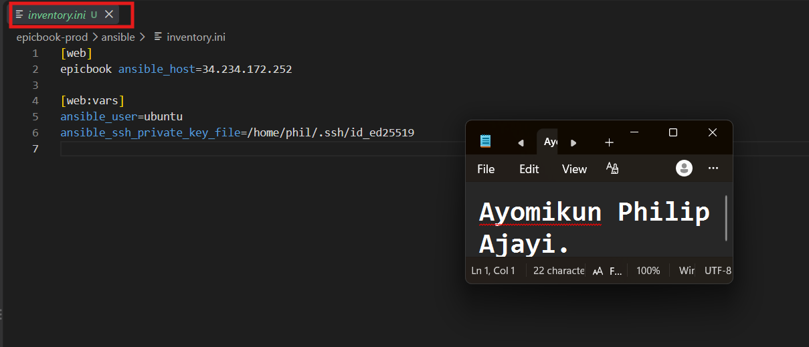

---

#### Screenshot 8 — Output of `ansible-inventory -i inventory.ini --graph`

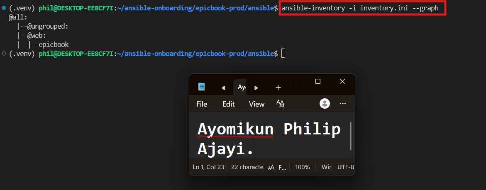

---

#### Screenshot 9 — Output of `ansible web -i inventory.ini -m ping`

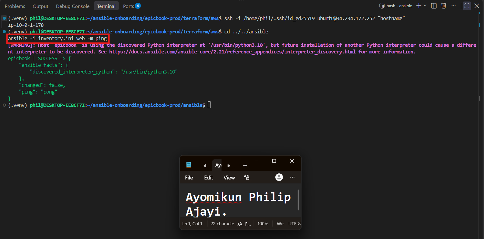

---

### Notes

Answer the following in your own words:

**1. What is the purpose of `inventory.ini`?**

It tells Ansible which servers to manage and how to connect to them.

---

**2. What does `ansible_host` store?**

The address of the server. Here it is the VM's public IP.

---

**3. What does `ansible_ssh_private_key_file` tell Ansible?**

The path to my private SSH key, which Ansible uses to log in.

---

**4. Why is `host_key_checking = False` used only for this temporary lab?**

It skips the question about trusting a new server's fingerprint, which is handy in a short lab. In production that check protects against someone pretending to be your server.

---

# Task 5 — Create the Main Ansible Playbook

## Goal

Create the main Ansible playbook that runs the required roles in the correct order.

The `site.yml` file will call the `common`, `nginx`, and `epicbook` roles.

### Evidence

#### Screenshot 10 — `site.yml` showing the roles in the correct order

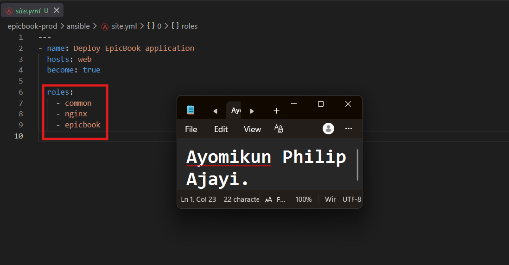

---

#### Screenshot 11 — Output of `ansible-playbook -i inventory.ini site.yml --syntax-check`

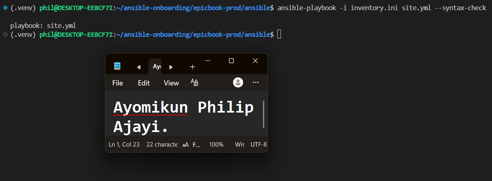

---

### Notes

Answer the following in your own words:

**1. What is the purpose of `site.yml`?**

It is the main playbook. It says which servers to target and which roles to run.

---

**2. Why should the roles run in the order `common`, `nginx`, and `epicbook`?**

Common prepares the server first, nginx sets up the web front next, and epicbook deploys the app last, once everything it needs is ready.

---

**3. What does `become: true` allow Ansible to do?**

It lets Ansible run tasks with admin rights, which is needed for installing packages and editing system files.

---

# Task 6 — Create the `common` Role

## Goal

Create the `common` role to prepare the Ubuntu VM with the basic packages required for the EpicBook deployment.

This role handles the common server setup before Nginx and the application are configured.

### Evidence

#### Screenshot 12 — `roles/common/tasks/main.yml` showing the common setup tasks

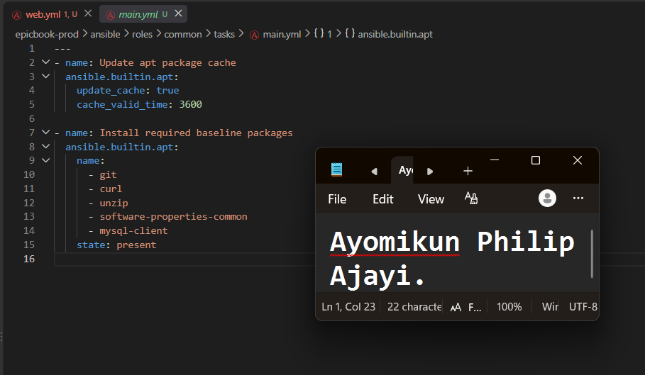

---

### Notes

Answer the following in your own words:

**1. What is the responsibility of the `common` role?**

It prepares the server with the basic tools the other roles need: git, curl, unzip, software-properties-common and mysql-client.

---

**2. Why should Nginx installation not be placed inside the `common` role?**

Nginx has its own job and settings. A separate role keeps the code cleaner and easier to reuse.

---

**3. Why is `mysql-client` useful in this deployment?**

It lets the server talk to the managed MySQL database, so I can import the SQL files and test the connection.

---

# Task 7 — Create the `nginx` Role

## Goal

Create the `nginx` role to install Nginx and configure it as a reverse proxy for the EpicBook application.

Nginx will receive browser traffic on port `80` and forward it to the EpicBook Node.js application running on the VM.

### Evidence

#### Screenshot 13 — `roles/nginx/tasks/main.yml` showing Nginx installation and site configuration tasks

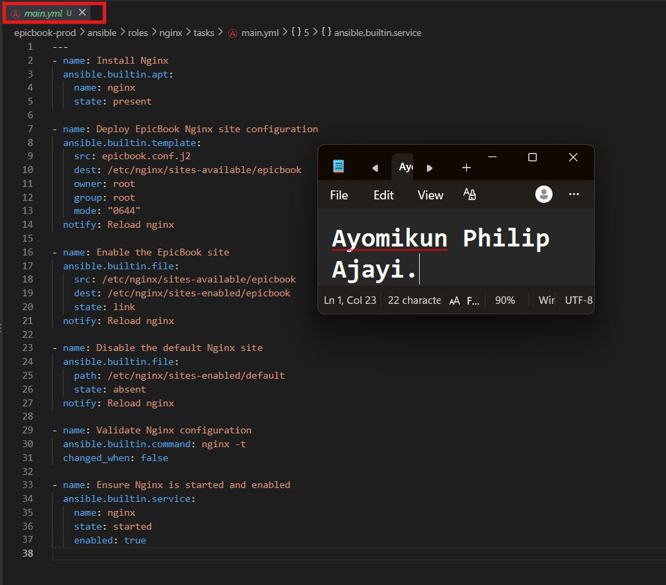

---

#### Screenshot 14 — `roles/nginx/templates/epicbook.conf.j2` showing the reverse proxy configuration

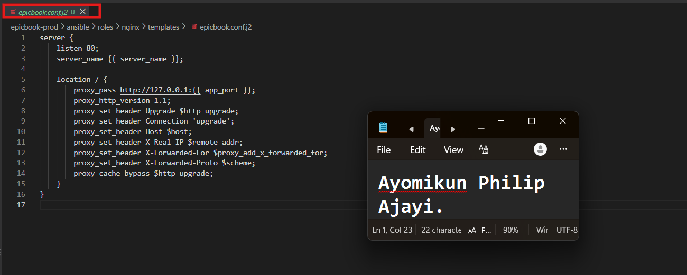

---

### Notes

Answer the following in your own words:

**1. What is the responsibility of the `nginx` role?**

It installs Nginx and configures it to pass web traffic to the app.

---

**2. Why is Nginx configured as a reverse proxy in this deployment?**

Nginx receives traffic on port 80 and forwards it to the app on port 8080. Visitors don't need to type a port, and the app stays behind Nginx.

---

**3. Why should the application port come from `group_vars/web.yml` instead of being hard-coded?**

If the port changes, I only edit one file and every role stays in sync.

---

# Task 8 — Create the `epicbook` Role

## Goal

Create the `epicbook` role to deploy the EpicBook application, connect it to the managed MySQL database, and run the application on port `8080` using PM2.

### Evidence

#### Screenshot 15 — `roles/epicbook/tasks/main.yml` showing application deployment tasks

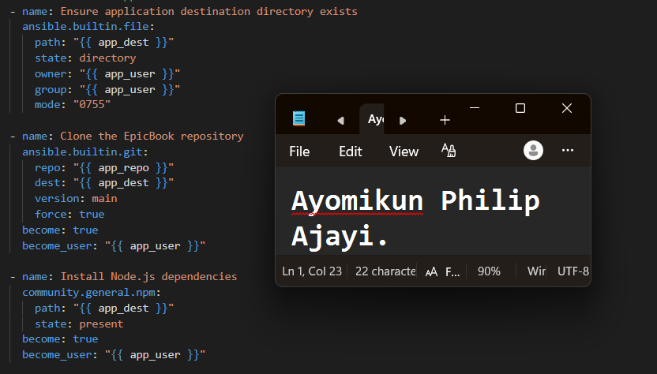

---

#### Screenshot 16 — Task or file showing how the database connection is configured, with secrets hidden

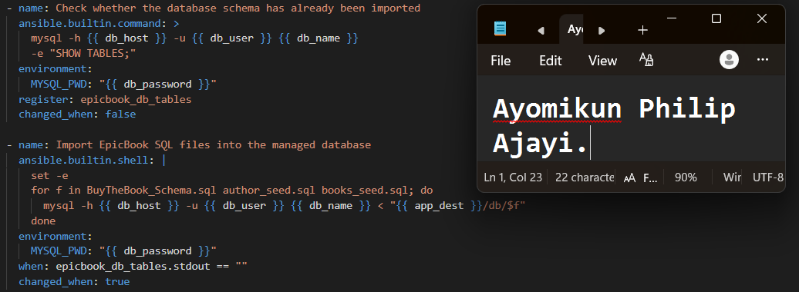

---

#### Screenshot 17 — Task or output showing the EpicBook application managed by PM2

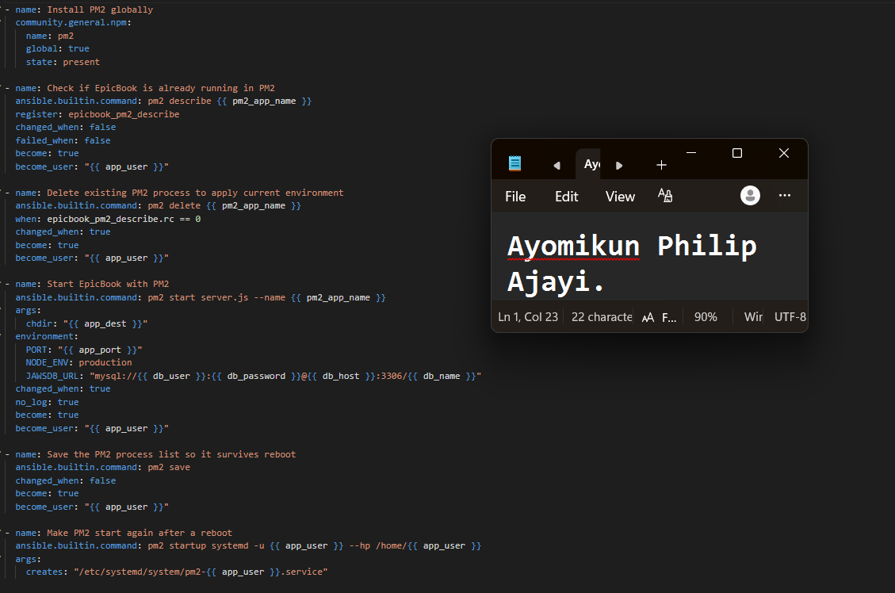

---

### Notes

Answer the following in your own words:

**1. What is the responsibility of the `epicbook` role?**

It downloads the EpicBook code, installs its packages, sets up the database connection, loads the tables and book data, and runs the app with PM2.

---

**2. Why is PM2 used for the EpicBook Node.js application?**

PM2 keeps the app running in the background, restarts it if it crashes, and starts it again after a reboot.

---

**3. Why should database passwords not be hard-coded in public files?**

Anyone who can see the files could steal the password and get into the database.

---

**4. What does it mean for the application to run on port `8080` while Nginx listens on port `80`?**

The app listens on 8080 inside the server. Nginx listens on 80 for visitors and passes their requests to 8080.

---

# Task 9 — Create Group Variables

## Goal

Create reusable variables for the EpicBook deployment.

The `group_vars/web.yml` file stores values that can be reused across the Ansible roles.

### Evidence

#### Screenshot 18 — `group_vars/web.yml` showing the application, PM2, and database variables, with passwords hidden or masked

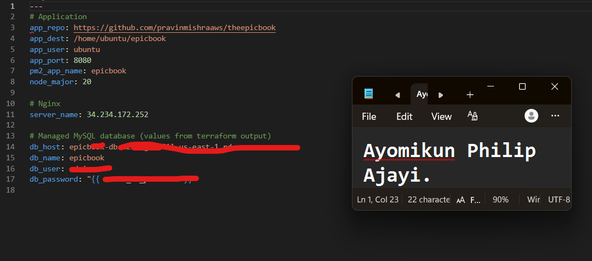

---

### Notes

Answer the following in your own words:

**1. What is the purpose of `group_vars/web.yml`?**

It keeps the values shared by the roles in one place, so the tasks stay clean and easy to change.

---

**2. Which values did you store in `group_vars/web.yml`?**

The repo URL, app folder, app user, app port, PM2 app name, server name, database host, database name, database user, and a reference to the password.

---

**3. How did you handle the database password securely?**

I stored the password in an encrypted Ansible Vault file. The variables file only refers to it as {{ vault_db_password }}, and I run the playbook with --ask-vault-pass.

---

# Task 10 — Run the Ansible Playbook

## Goal

Run the Ansible playbook to configure the VM and deploy the EpicBook application.

The playbook should run the roles in this order:

1. `common`
2. `nginx`
3. `epicbook`

### Evidence

#### Screenshot 19 — Ansible playbook output showing the roles running

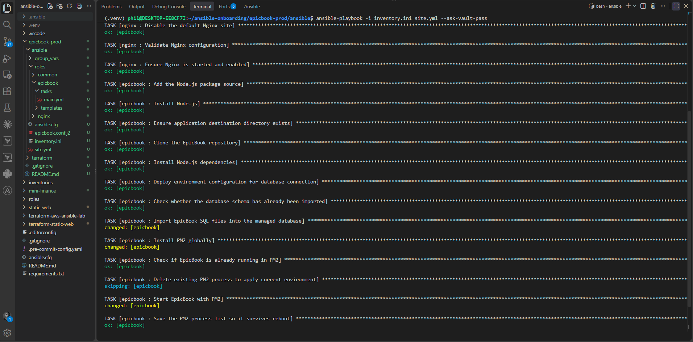

---

#### Screenshot 20 — Final Ansible recap showing `failed=0`

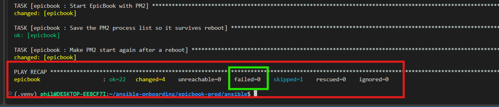

---

#### Screenshot 21 — Output of `ansible web -i inventory.ini -m command -a "systemctl is-active nginx" --become`

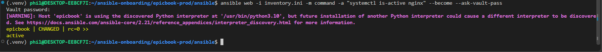

---

#### Screenshot 22 — Output of `ansible web -i inventory.ini -m command -a "pm2 status"`

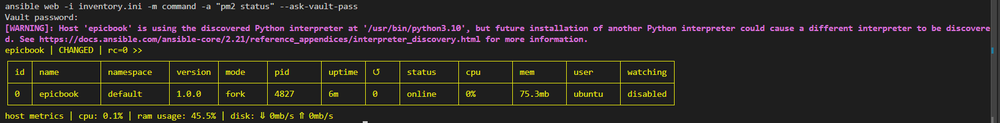

---

#### Screenshot 23 — Output of `ansible web -i inventory.ini -m command -a "curl -I http://localhost:8080"`

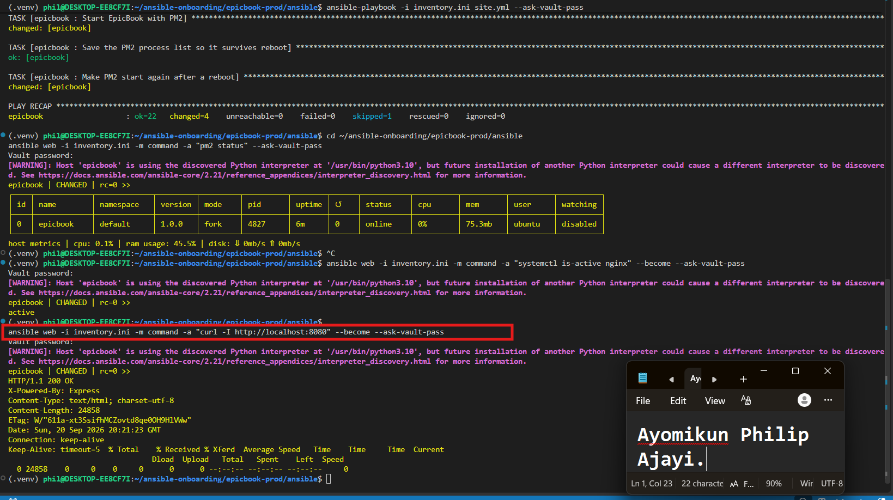

---

### Notes

Answer the following in your own words:

**1. What command did you run to execute the Ansible playbook?**

ansible-playbook -i inventory.ini site.yml --ask-vault-pass

---

**2. How do you know all roles completed successfully?**

The recap at the end showed failed=0, with all 22 tasks reporting ok or changed.

---

**3. What proves that Nginx is active?**

The command systemctl is-active nginx returned active.

---

**4. What proves that PM2 is managing the EpicBook application?**

pm2 status showed the epicbook process online with 0 restarts.

---

**5. What proves that the EpicBook application responds on port `8080`?**

curl -I http://localhost:8080 returned HTTP/1.1 200 OK.

---

# Task 11 — Verify the EpicBook Deployment

## Goal

Verify that the EpicBook application is running, accessible in the browser, and connected to the managed MySQL database.

### Evidence

#### Screenshot 24 — Output of `curl -I http://<public_ip>`

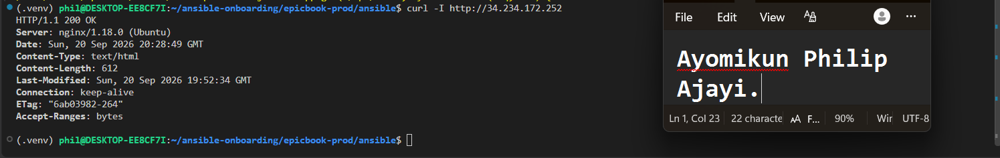

---

#### Screenshot 25 — Output of the cart API test command

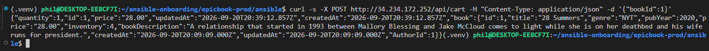

---

#### Screenshot 26 — Output of the `/cart` HTTP status check

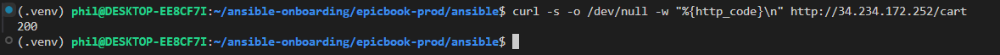

---

#### Screenshot 27 — Browser showing the EpicBook application loaded from `http://<public_ip>`

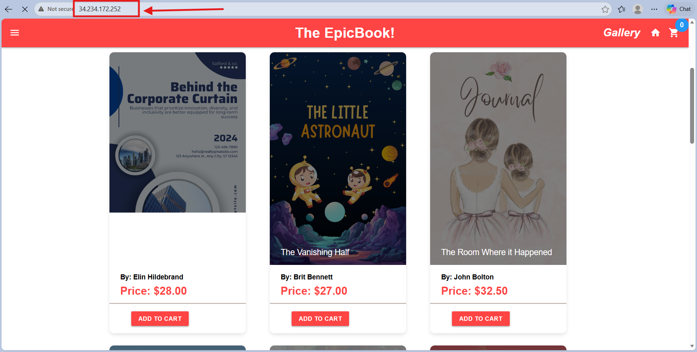

---

### Notes

Answer the following in your own words:

**1. What HTTP response did you receive from the public application URL?**

I got HTTP/1.1 200 OK, which means the site is up and answering.

---

**2. What did the cart API test prove?**

It proved the whole chain works. The request went through Nginx to the Node.js app and on to the MySQL database. The reply contained a real book from the database ("28 Summers") plus a new cart entry, so the app can both read and write data.

---

**3. What did the `/cart` status check return?**

It returned 200, which means the cart page loads successfully.

---

**4. What issue did you face during verification, and how did you fix it?**

The SQL import first failed with Unknown database 'bookstore', because the app's SQL files expect that name and my database is called epicbook. I fixed it by swapping the name with sed while importing. The browser also showed the Nginx welcome page at first, and reloading Nginx fixed it.

---

# LinkedIn Post Required

## Evidence

#### LinkedIn Post URL

Paste your LinkedIn post URL here:

`https://www.linkedin.com/posts/ayomikunphilip_dmibypravinmishra-devops-terraform-activity-7507765851127853057-y06p?utm_source=social_share_send&utm_medium=member_desktop_web&rcm=ACoAAF4cLMMBGj_ND3_b5bGU28ywvq8aZAW62fs`

---

#### Screenshot — Published LinkedIn post

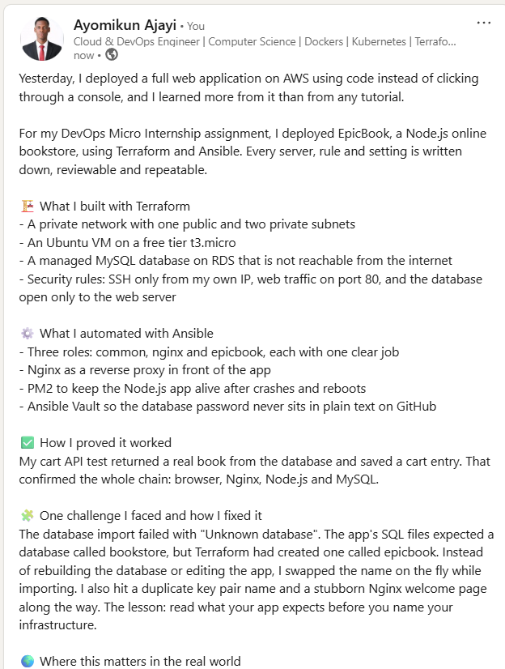

---

# Assignment Questions

Answer the following in your own words:

**1. Why is Terraform used for infrastructure provisioning?**

It builds infrastructure from code, so it is repeatable, easy to review with a plan, and easy to delete and rebuild.

---

**2. Why are Ansible roles useful for production-style deployments?**

Each role does one job, so the code is easier to read, reuse and fix, and the order of the steps is clear.

---

**3. What is the purpose of `group_vars/web.yml`?**

It stores shared values in one place, so I don't repeat them inside every role.

---

**4. Why should database passwords not be committed to GitHub?**

Anyone can read a public repo, bots scan for leaked passwords, and Git history keeps them even after you delete them.

---

**5. What is the purpose of Nginx in this deployment?**

It receives visitors on port 80 and passes their requests to the Node.js app on port 8080. It also hides the app port and can later handle HTTPS.

---

**6. Why should the managed MySQL database not be publicly accessible?**

A public database can be attacked from anywhere. Keeping it private means only my web server can reach it.

---

**7. Why is PM2 used for the EpicBook Node.js application?**

It keeps the Node.js app running in the background, restarts it if it crashes, and brings it back after a reboot.

---

**8. What does idempotency mean in Ansible?**

Running the same playbook again gives the same result and only changes what needs changing. My second run showed mostly ok for that reason.

---

**9. What issue did you face during the deployment, and how did you fix it?**

Terraform failed at first because a key pair with the same name already existed in AWS, so I gave mine a new name. Later the SQL import failed because the app expected a database named bookstore. I fixed it by replacing the name while importing.

---

**10. What security improvement would you make before using this setup in production?**

I would add HTTPS with a domain and a free certificate, keep Terraform state in a locked remote place like S3, and store the database password in AWS Secrets Manager. I would also turn on database backups and encryption.

---

# Required Files

Confirm that the following files are included in your GitHub repository or assignment folder:

- [ ] `README.md`
- [ ] Terraform files under either `terraform/azure/` or `terraform/aws/`
- [ ] `ansible/ansible.cfg`
- [ ] `ansible/inventory.ini`
- [ ] `ansible/site.yml`
- [ ] `ansible/group_vars/web.yml`
- [ ] `ansible/roles/common/tasks/main.yml`
- [ ] `ansible/roles/nginx/tasks/main.yml`
- [ ] `ansible/roles/nginx/templates/epicbook.conf.j2`
- [ ] `ansible/roles/epicbook/tasks/main.yml`

---

# Submission Instructions

- Add all required screenshots in your submission.
- Full Name must be visible in required screenshots.
- Mention the cloud provider used: Azure or AWS.
- Add the VM public IP address.
- Add the final application URL.
- Add Terraform output proof.
- Add Ansible role tree proof.
- Add all required notes and assignment question answers.
- Add your LinkedIn post URL.
- Do not expose SSH private keys, passwords, cloud credentials, database credentials, Terraform state files, subscription IDs, or account IDs.

---

# Completion Checklist

- [ ] Task 1: Project folder layout created
- [ ] Task 2: Terraform infrastructure provisioned
- [ ] Task 3: SSH key-based access verified
- [ ] Task 4: Ansible inventory and configuration created
- [ ] Task 5: Main Ansible playbook created
- [ ] Task 6: `common` role created
- [ ] Task 7: `nginx` role created
- [ ] Task 8: `epicbook` role created
- [ ] Task 9: Group variables created
- [ ] Task 10: Ansible playbook run completed
- [ ] Task 11: EpicBook deployment verified
- [ ] Terraform files created under only one cloud provider folder
- [ ] One Ubuntu VM was created
- [ ] One managed MySQL database was created
- [ ] SSH port `22` is restricted to the controller public IP
- [ ] HTTP port `80` is accessible
- [ ] MySQL port `3306` is not publicly open
- [ ] `ansible web -i inventory.ini -m ping` returns `SUCCESS`
- [ ] `site.yml` calls the roles in the correct order
- [ ] Database secrets are hidden or handled securely
- [ ] Nginx is active
- [ ] PM2 shows the EpicBook application running
- [ ] EpicBook responds on port `8080`
- [ ] Public URL loads in the browser
- [ ] Cart API verification works
- [ ] Playbook completes with `failed=0`
- [ ] Screenshots 1–27 are included
- [ ] Assignment questions are answered
- [ ] LinkedIn post published
- [ ] LinkedIn post URL added
- [ ] No sensitive information is exposed

---

## About DMI & CloudAdvisory

DevOps Micro Internship (DMI) is a project-based DevOps program run by Pravin Mishra and The CloudAdvisory, focused on real-world execution, systems thinking, and career readiness.

It helps learners build strong DevOps foundations with hands-on experience.

---

## Resources

- DMI Official Website: [https://dmi.pravinmishra.com?utm_source=github&utm_medium=readme](https://dmi.pravinmishra.com?utm_source=github&utm_medium=readme)
- University: [https://university.pravinmishra.com?utm_source=github&utm_medium=readme](https://university.pravinmishra.com?utm_source=github&utm_medium=readme)
- Discord Community: [https://discord.pravinmishra.com?utm_source=github&utm_medium=readme](https://discord.pravinmishra.com?utm_source=github&utm_medium=readme)
- Blog: [https://dmi.pravinmishra.com/blog?utm_source=github&utm_medium=readme](https://dmi.pravinmishra.com/blog?utm_source=github&utm_medium=readme)
- YouTube Playlist: [https://www.youtube.com/playlist?list=PLFeSNDtI4Cho](https://www.youtube.com/playlist?list=PLFeSNDtI4Cho)
- Pravin Mishra LinkedIn: [https://www.linkedin.com/in/pravin-mishra-aws-trainer/](https://www.linkedin.com/in/pravin-mishra-aws-trainer/)
- CloudAdvisory LinkedIn: [https://www.linkedin.com/company/thecloudadvisory/](https://www.linkedin.com/company/thecloudadvisory/)

---

*This submission is part of DevOps Micro Internship (DMI) — Agentic AI Track.*